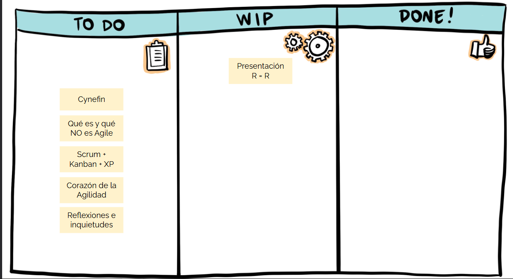
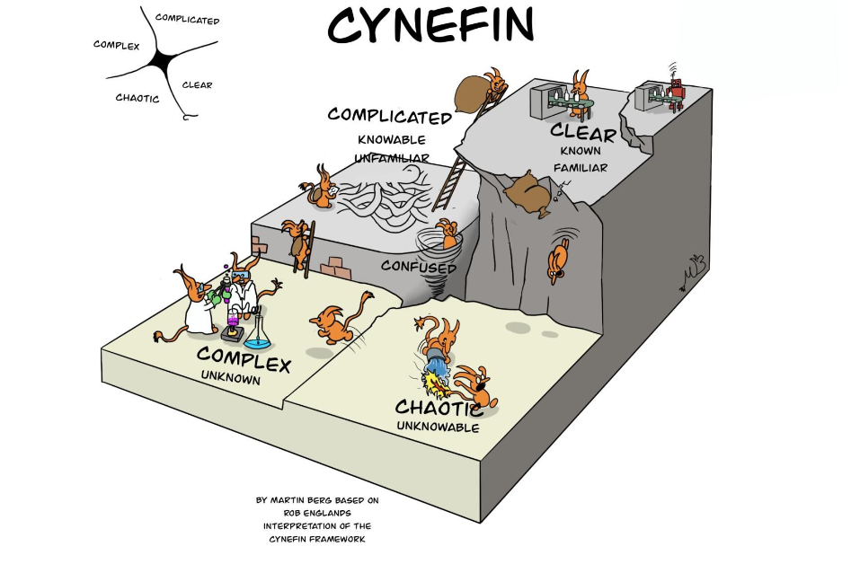

# tecnicas de diseño agile

## kanban

es una tabla donde se ponen las cosas que se deben hacer, consta de 3 columnas: to do, wip (work in progress) y done

## marco cynefin

es un framework para separar las tareas a realizar en base a la complejidad (o mas bien el desconocimiento de la solucion por parte del equipo) para poder entender mejor los problemas

### Claro

Mejores practicas

son los mecanismos que ya estan definidos, son esas cosas que ya se saben como resolver y son hasta rutinarias

Detectar/Clasificar/Responder

### Complicado

Buenas practicas

Son esas cosas que tal vez no estan tan claras y requieren un poco mas de esfuerzo, estas varian segun quien las encare
Detectar/Analizar/Responder

### Complejo

Practicas emergentes

Son aquellas situaciones donde no esta claro el como ir del punto a al pun b, aca ya se debe experimentar ya qque no esta todo claro de como resolverse, muchas veces influyen variables que escapan a nuestro control

Experimentar/Detectar/Responder

### Caotico

Practicas novedosas

Esta todo mal, no exite un camino como tal, existen quizas protocolos que amorticen el efecto pero no esta todo planteado

Actuar/Detectar/Responder

### Desorden

todo lo que esta en el medio y donde mayor conflicto existe

## agilidad

tiene un apunte propio

## scrum 

es un metodo de desarrollo donde se dividen las taareas en ciclos de iteraciones, mas adelante en los apuntes se profundiza mas

## xtreame programing

es una variante de scrum (se vera mas adelante si profudizar en ella)