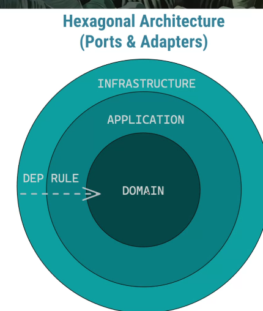

# calidad de software

que todos los atributos sean buenos no significa que sean buenos, todo cuesta tiempo y dinero asi que a veces hay que hacer trade off

siempre probar los casos donde ocurre un desastre 

## performance

se mide en capacidad y tiempo de respuestas por evento(latencia)

## PATRO  LAYERS

consiste en dividir el diseño en capas

## BROKER

consiste en meter un distribuidor entre distintos proveedores de servicios

## PIPE AND FILTERS

consiste en un conjunto de filtros(middleware) que van modificando la entrada hasta llegar a una request final deseada

## ARQUITECTURA HEXAGONAL

consiste en plantear mi sistema en base a mis casos de uso, donde todo lo demas sea periferico(bases de datos, otros servicios, etc)

## REPOSITORY PATTERN

es el patron que consiste es delegar la obtension de datos a otro servicio respetando asi la d de solid

## Devops = saber manejar microservicios

## QA 