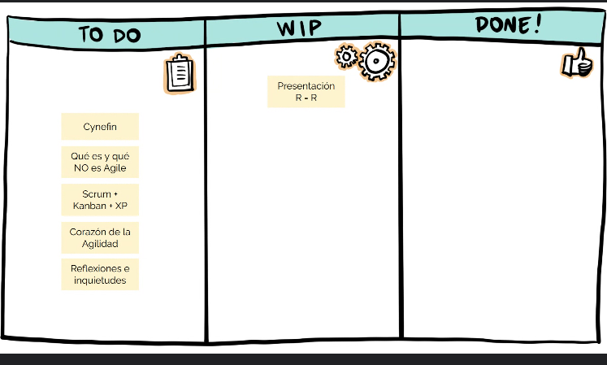
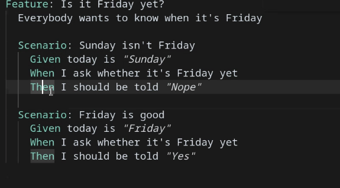
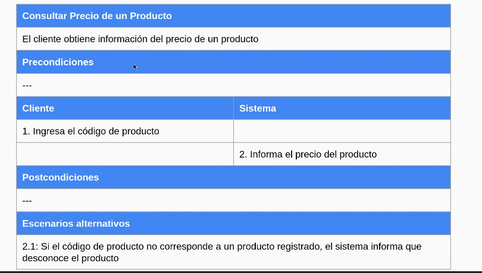

# historias de usuario

es una descripcion de una funcionalidad del sistema dada por un usuario (tiene que ser una persona)

como <persona>
quiero <funcion>
para <objetivo>

proveen valor al cliente

ejemplo:
**como** carta (estudiante universitaria)
**quiero** consultar el listado de cursos disponibls
**para** decidir a que curso anotarme

### framewok qus (quality user story)

calidad sintactica bien formadas, minimas, atomicas

calidad semantica conceptualmente acertadas sin ambiguedades orientadas al problema sin conflictos

calidad pragmatica usan oraciones completas, estimables, unicas, uniformes, independientes, completas

card: describe intencion del usuari

conversation: los interesados se comunican para refinar las historias

confirmation: criterios de aceptacion

### criterios de aceptacion

- lista de condiciones
- escenarios
dado que <contexto>
cuando suceda <evento>
entonces <consecuencia>

debene ser 
- claros
- concisos
- verificables
- independientes
- orientados al problema

### behaviour driven development

es como tdd pero mas orientado al comportamiento del usuario

**cucumber**

### casos de uso 

### como encontrar historias

- establecer limites del sistema

- identificar actores involucrados en el sistema

- buscar objetivos y actividades

-- user sotry mapping
-- impact mapping0