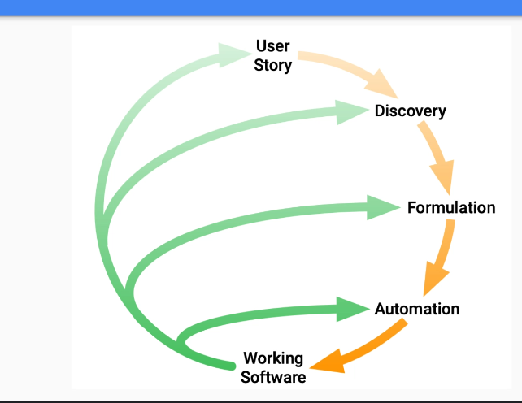
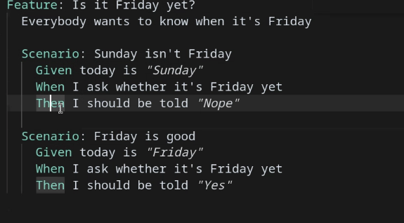
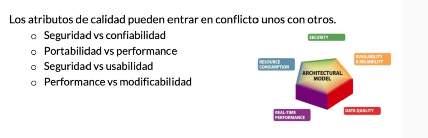
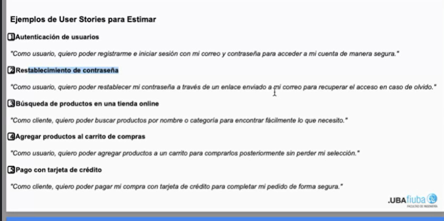
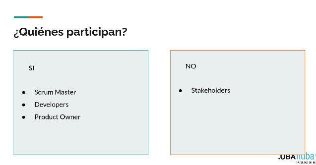
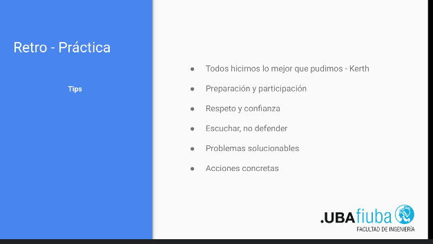

# scrum

## scrum master

## developer team

son los developers que a lo largo de spings van a iterar soluciones 

## product owner

es el que toma las historias y realiza las entrevistas al cliente, el tiene que cargar las histoiras y darles la prioridad, el junta las historias y es el encargado de detallar y 

## product back log

son varias historias del producto desordenadas que juntas construyen el proposito del proyecto

## scrum master

es el que ayuda destrabar y es el encargado de organizar las tecnicas del scrum, no es el pm (es el 5), es el lider que no es lider

## equipo de desarrollo

son los developers, cada uno se encarga de un rol pero todos siguen las gestiones y organizaciones del scrum master

## ceremonias

### spring planning

se organiza el product backlog, se prioriza y se dividen las tareas extraidas del backlog y en ellas ya se definen los plazos de trabajo, se agarra historias de usuario y se definen tiempos para cada uno, suele ser mas prescenciales

### dayly scrum

son reuniones breves rapidas y diarias donde se explican los avances y se pone al dia de como viene cada uno, se analiza avances, bloqueos y se tiran ideas, estan todos, scrum master incluido aunque es opcional (mayormente es del developer)

### spring backlog

son las historias de usuario que van tocarse en el siguiente spring al plannig, la idea es definir tareas y poder estimarlas 

## spring

son las iteraciones, duran entre 1 a 4 (promedio 2) semanas, una vez definidas las tgareas se hacen en un spring, si surgen nuevas tareas se las pasan al siguiente (se suele estimar en complejidad no en tiempos), pueden aparecer urgencias pero en principio no 

## spring review (equipo de desarrollo, product owner y scrum master (a veces entra tambien el cliente))

es una demo, es como el spring final donde el cliente prueba el producto y el equipo muestra sus avances (esta bueno que el que habla en las reuniones no sea siempre el mismo), se celebran los logros y se evalua el feedback , las demo deben ser funcionales

## retro

al fin del spring se hace la retro, es el ultimo dia del spring post review, se analiza que salio bien y que no, se pueden usar votaciones, se mejoran procesos y no se buscan culpas

## springs image

## refinamiento del backlog

es basicamente ir mejorando y laburando el backlog y las tareas definidas

## mvp producto minimo viable

se decide que es lo minimo que se tiene que alcanzar para decir que se alcanzo algo positivo y que se puede seguir 

## estimaciones

es definir el tiempo relativo de las tareas en base al esfuerzo relativo de las misma, planning poker y tshirt size son las mas usadas, siempre se busca un consenso 

## velocidad del equipo

cantidad de puntos o history ponts que costo cada spring, se hace un historico despues del primer spring

## metricas

### burndown chart

es un balance entre los story points estimados por sprint vs los story points diarios que fueron descendiendo , se divide en 2 lineas, la ideal que es la promediada vs la real

### Epic Burndown 

#### epica 

es un modulo / conjunto de historias

a cada epica se le definen su costo en history points y se calculo durante el spring el que tanto demoro esa epica en puntos 

### estimaciones practicas

distintas historias

antes de estimar una epica se hacen 400 preguntas para poder dividirla en partes

### criterios de aceptacion

post entrevista son los criterios definidos para decir que efectivamente se llevo bien a cabo la tarea

- crear forma de registro 
- login
- alguna validacion 
- hashear la contraseña 
- almacenamiento de los usuarios

### sprint plannig

un mes de sprint debe tomar maximo 8 hrs de esta ceremonia, lo importante es poner en comun el entendimiento de los requerimientos del proyecto, la idea e poner en claro que se busca en dicho proyecto , ayuda a ser transparente, ayuda tambien a estimar correctamente, lo importante es que todos entiendan la misma informacion, participa el scrum master, los devs y los product owner, state holders (son los interesados en el producto) (normalmente no partipan)

#### porque 

es el objetivo del spring 

#### que

se seleccionan las tareas que se realizaran del backlog 

#### como

se empieza a pensar el como realizar dichas tareas , es un plan inicial 

### resultados

- objetivo del sprint

- backlog completo

- plan inicial

- que impedimentos existen que bloquean al equipo

### review = retro (no lo son)

no es lo mas copado hacerlos en la misma llamada, se hacen al ultimo dia

### sprint review

se reunon los team devps y scrum master donde se le muestra al product owner y stake holder que es lo que se logro, se muestran los logros y se muestra que se hizo yh que se logor

### retrospectiva

es del equipo, se ve lo que se hizo bien, lo mal y lo que hay que mejorar, es una reflexion, lo importante es obtener el feedback de los stacke holder

se ve lo malo con el objetivo de no repetir eso y se busca lo bueno para repetrilo 

todo lo hicimos lo mejor que pudimos 

