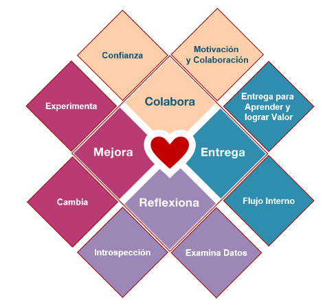

# agilidad

es un concepto sobre el cual se amparan ciertas tecnicas, metodologias y filosofias sobre el desarrollo de sofware

## manifiesto por el desarrollo agil del software

estamos descubriendo formas mejores de desarrollar software tanto propias como para terceros, gracias a esto aprendimos a valorar

*individuos e interacciones* sobre procesos y herramientas
*Software funcionando* sobre documentancion extensiva
*colaboracion con el cliente* sobre negociacion contractual
*Respuesta ante el cambio* sobre seguir un plan

aunque valoremos los elementos de la derecha, valoramos mas lo de la izquierda

## principios del manifiesto agil

1. nuestra mayor prioridad es satisfacer al cliente mediante la entrega temprana y continua de software de valor
2. aceptamos que los requisitos cambien aun en etapas tardias de desarrollo, los proceso agiles aprovechan el cambio para dar ventaja competitiva al cliente
3. entregamos software funcional frecuentemente, entre 2 semanas y 2 meses priorizando el periodo de tiempo mas corto
4. los responsables del negocio y desarrolladores trabajamos juntos de forma cotidiana durante todo el proyecto
5. los proyectos se desarrollan entorno a individuos motivados, hay que darles el apoyo que se necesita y confiarles la ejecucion del trabajo
6. el metodo mas eficiente para comunicar cosas en el equipo es mediante la conversacion cara a cara
7. el software funcionando es la medida del progreso
8. los procesos agiles promueven el desarrollo sostenible, todas las partes involucradas deben poder mantener un ritmo constante de forma indefinida
9. la atencion continua a la excelencia tecnica y al buen diseño mejora la agilidad
10. La simplicidad, o el arte de maximizar la cantidad de trabajo no realizado, es esencial.
11. Las mejores arquitecturas, requisitos y diseños emergen de equipos auto-organizados.
12. A intervalos regulares el equipo reflexiona sobre cómo ser más efectivo para a continuación ajustar y perfeccionar su comportamiento en consecuencia.

## corazon de la agilidad

la agilidad tiene 4 principios basicos y sencillos: colabora, entrega, reflexiona y mejora, estas cuatro palabras imperativas son el kokoro o el corazon de la agilidad

el texto empieza a enumerar los estadios del aprendisaje segun la filosofia japonesa

### shu

es el estadio mas basico donde el alumno solo aprende una tecnica mediante la repetecionn de la misma por parte del maestro

### ha 

es el estadio intermedio donde el alumno aprende distintas tecnicas y las va agrupando en sus conocimientos decidiendo asi cuales son las que mas le convencen

### ri

es el estadio donde si saber como el alumno ejecuta las tecnicas por su propia cuenta y decision sin saber de donde viene la inspiracion para hacerlas

### kokoro

es la vuelta a las bases, el alumno vuelve al estadio inicial para no perder las bases que lo llevaron a otro estadio

## el corazon se expande

si bien los 4 verbos son bastante completos, hay una version expandida del corazon que estaria bueno indagar

### colaborar

para que el equipo colabore necesita confianza, sobre como generar confianza existen miles de libros, mismo para generar motivos de colaboracion, la realidad es que sea como sea que se genere tanto la confianza como los motivos para colaborar estos son fundamentales para la colaboracion del equipo

### entrega

tiene aspectos internos y externos  internamente es la manofactura Lean, gestion de cuellos de botella, limites de WIP y procesos tecnologicos y sociales para la entrega, o sea son las formas de entregar contenido de software, en lo externo encontramos entregar para obtener valor, para obtener aprendizaje, entregar para estudiar el mercado, son los porque de los outputs

### Reflexionar y mejorar

estan estrechamente relacionados pero suelen estar separados debido a que la gente no suele reflexionar correctamente, es escencial detenerse a analizar tanto a nivel emocional como empirico el resultado de las cosas para luego poder mejorar