# modelo de dominio

## complejidad en el desarrollo de software

complejidad = complejidad escencia + complejidad accidental

complejidad escencial = complejidad del problema + complejidad de la solucion

## mecanismos para atacar complejidad

- descompocision -> descubrir
- abstraccion -> pensar
- establecer jerarquias -> inventar

## modelo

es una representacion simplificada de la realidad, permite vizualizar, entender y especificar un problema, sirve como guia y documentacion

casos de uso -> clases -> codigo

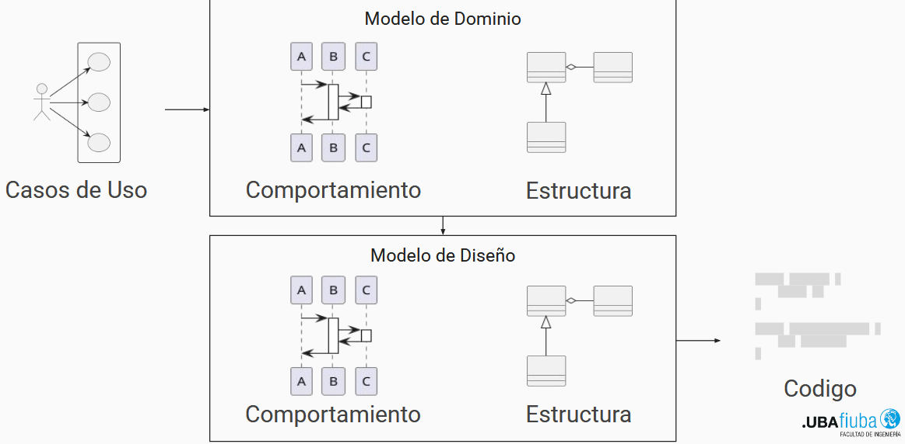

### modelo de dominio

busca entender a detallle el negocio y sus reglas para ello usa patrones de analisis o colaboracion

### modelo de diseño

busca implementar una solucion al modelo planteado en el eanalisis teniendo en cuenta las restrcciones impuestas por los requerimientos no funcionales, se resuelve mediante patrones de diseño

## tecnicas

algunas tecnicas utiles para modelar el dominio

### analisis sintactico

buscar sustantivos o verbos de casos de uso, minutas, etc

#### categorias utiles

- Actores (humanos o no)
- Objetos fisicos
- lugares
- eventos
- procesos

### crud: create, read, update, delete

toda entidad debe ser creada y leida en alguna funcionalidad, tambien podrian modificiarse o eliminarse, si una operacion falta entonces falta funcionalidad

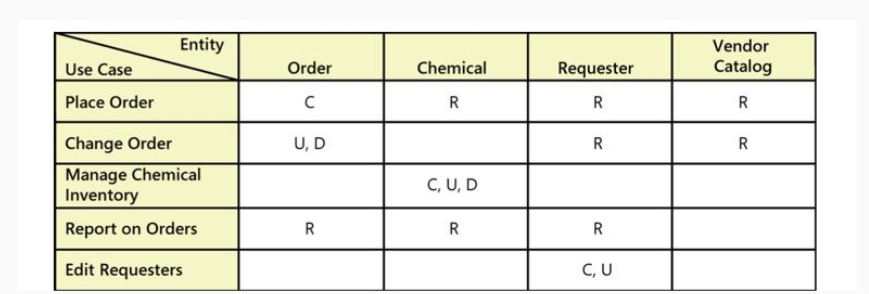

## patrones de colaboracion

### generico especifico

- actor / rol
- item / item especifico
- transacion completa / line item

### entero parte

- gran lugar / lugar
- ensamble / parte
- contenedor / contenido
- grupo / miembro

### especifico transaccion

- rol / transaccion
- lugar / transaccion
- item especifico / transaccion
- item especifico / line item
- transaccion / transaccio cronologica

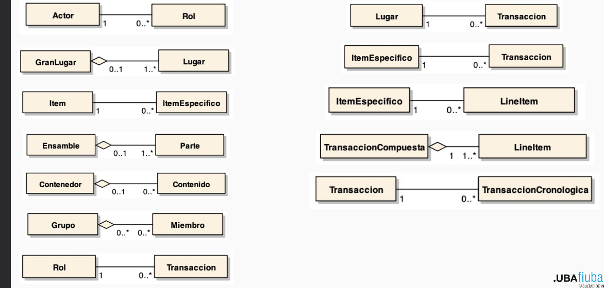

## reglas de negocio

son restricciones que gobiernan las acciones en el dominio de negocio

- en modelo se traducen como reglas de colaboracion
- la forma de incorporarlas consiste en restriccionees aser probadas antes de modificar las colaboraciones entre los distintos objetos del modelo
- en el modelo se traduce por ejemplo en si dos objetos pueden crear nueva relacion o remover una existente
- se ubican dentro del modelo ya que sino el mismo esta incompleto, sobretodo en el modelo del objeto con informacion mas relevante

### tipos de reglas

- tipo: una tira de asado puede ser cargada solo en un container refrigerado
- multiplicidad: un container refrigerado puede contener hasta 20 toneladas de carne
- propiedad: la temperatura del container debe ser menor a 0 grados
- estado: un corte de carne no puede ser almacenado si dicho corte paso una n cantidad de tiempo sin refrigeracion
- conflicto: un producto no puede ser sumado a una orden de compra de un menor de edad si el mismo esta prohibido para la venta a menores

## diagramas uml

unified modeling lenguage, sirve para unificar el modelado de sistemas, formaliza ciertos aspectos del desarrollo de software

## tipos de diagramas

### de clases 

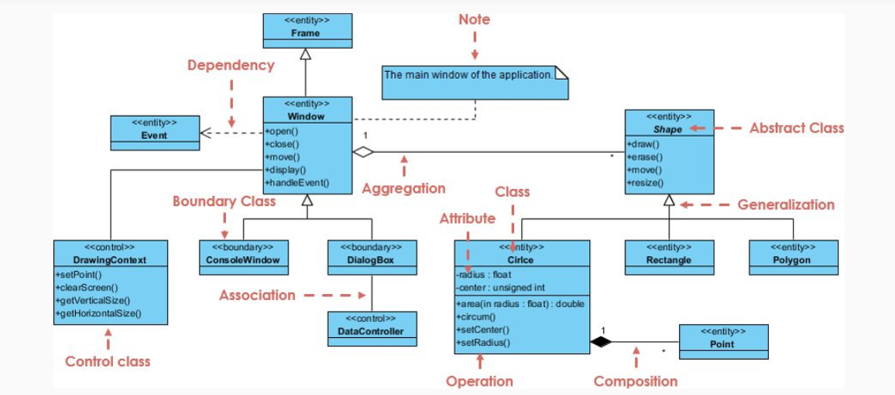

### de objetos

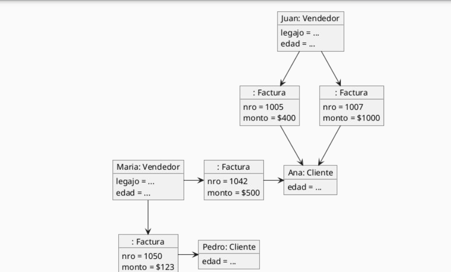

### de paquetes

estos se pueden agrupar por clases o concepto de dominio

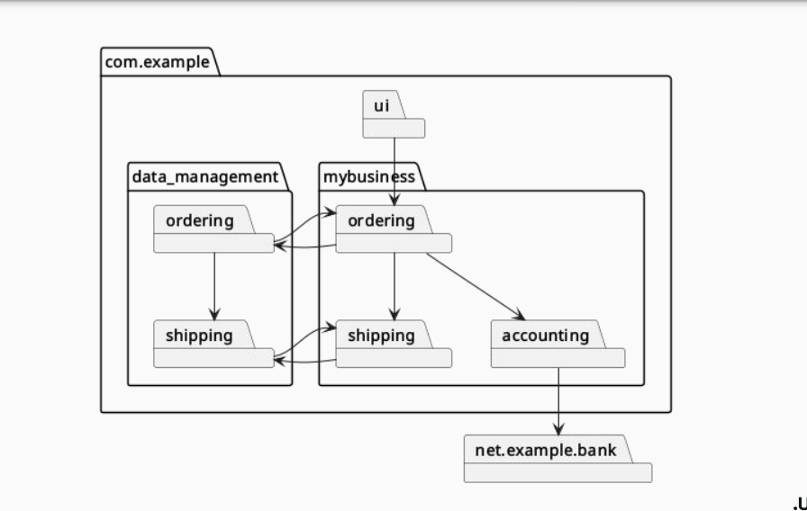

### de componentes

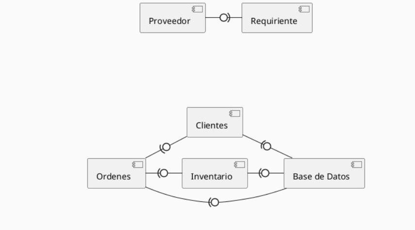

### de despliegue

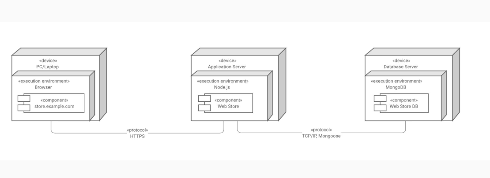

### diagrama de perfil

que es un esteriotipo?

es un mecanismo de extension, aplicado a un elemento de cualquie otro diagrama modifica como se interpreta, por ejemplo en spring boot las clases anotadas con @RestController generar comportamiento adicional en runtime y las que llevan JpaEntity generan metodos adicionales en compilacion

un perfil uml formaliza los esteriotipos, tags, restricciones, etc

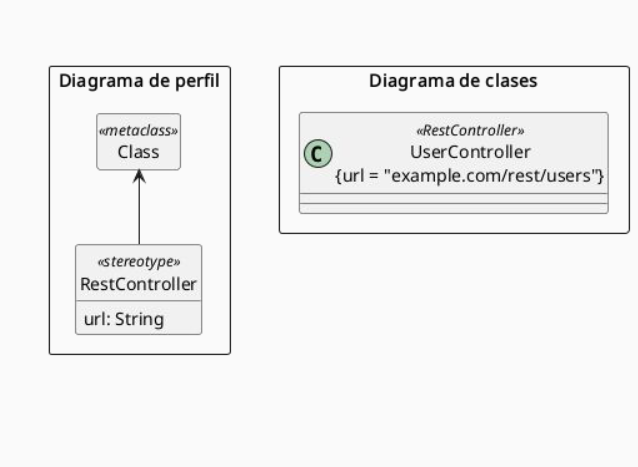

### de actividad

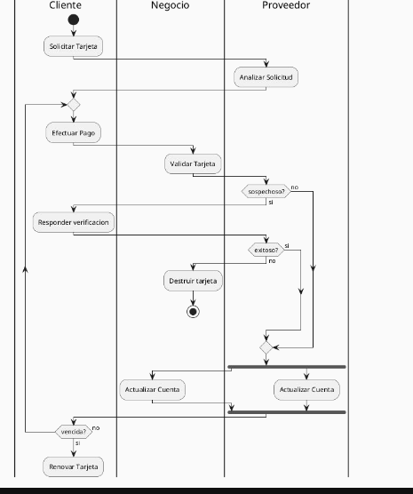

### de maquina de estados

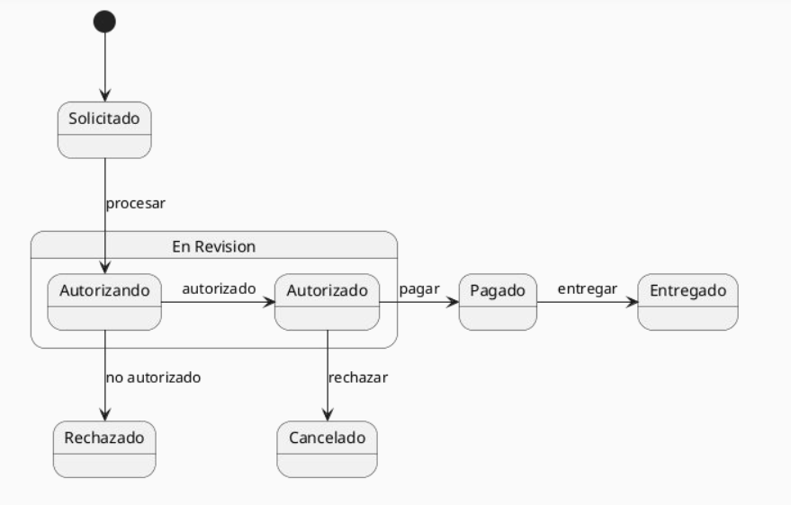

### de secuencia (lpqlp)

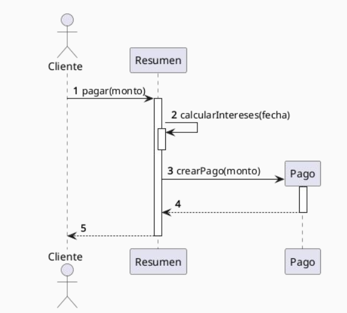

### de comunicacion

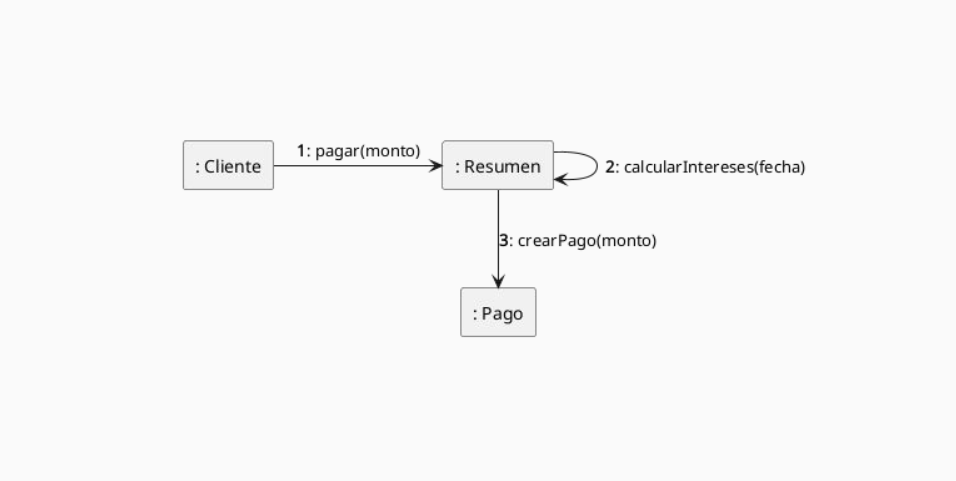

### de tiempos

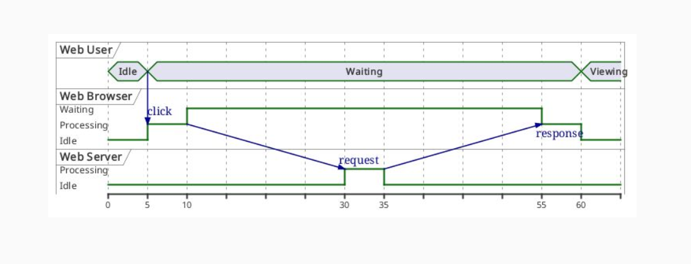