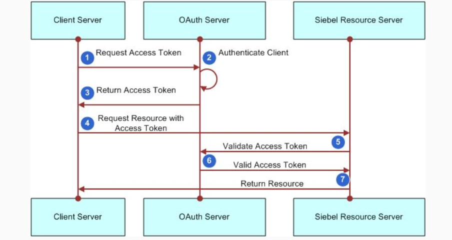

# api rest

no es un estandar, ni libreria, ni protocolo, surge de la tesis doctoral de Roy FIelding y significa Representational State Transfer, utiliza estandares existentes como HTTP, comunicacion cliente servidor y consta de 3 niveles de madurez

## caracteristicas

- cliente servidor
- Stateless
- Cacheable
- Expone recursos
- usa explicitamente verbos http
- Navegable

## stateless

- cada request se ejectura de forma independiente
- cada request tiene la informacion suficiente para completarse
- la API no mantiene ningun tipo de sesion
- usa tokens para la seguridad


## cacheable

- reduce el ancho de banda usado
- reduce latencia
- reduce carga en servidores
- oculta fallos de red
- lo que se define como cacheabilidad en los sistemas REST es la capacidad de estos para etiquetar de alguna forma las respuestas para que otros mecanismos intermedios funcionen como un cache
- estos sitemas o mecanismos intermedio (existen entre el cliente y el servidor) deben ser transparentes a los desarrolladores, no deben afectar la manera en la que los servicios se consumen

Expires

```java
Expires: Fri, 19 Nov 2021 19:20:49 EST
```

Cache-Control

```java
Cache-Control: max-age=3600
```

Last-Modified

```java
Last-Modified: Fri, 19 May 2021 09:17:49 EST
```

## Compresión

las APIs suelen retornar representaciones en varios formatos, entre ellos, formato plano, XML, Html y json, estos pueden ser comprimidos para ahorra ancho de banda


## URIs

- uniform resourse identifier
- identificacion univoca de recursos con STRING
- identifica recursos de clase o tipo
- usa sustantivos en plural por convencion
- distincion de recursos principales y subordinados

### URIs - Ejemplos

Recurso: clientes
- /clientes **representa todos los clientes**
- /clientes/1 **representa al cliente con id 1**
- /clientes?nombre=juan **representa a los clientes con nombre juan**
- /clientes/1/compras **representa a las compras del cliente 1**

## verbos http

- GET: solicita una represantacion de un recurso especifico
- POST: se utiliza para enviar una entidad/ recurso
- DELETE: borra
- PUT: remplaza un recurso
- PATCH:  aplica modificaciones parciales
- OPTIONS: es utilizado para describir las opciones de comunicación para el recurso de destino

## status code

- 1xx informational
- 2xx success
- 3xx redirection
- 4xx client error
- 5xx server error

### ejemplos

- 200 ok
- 201 created (con el location header)
- 400 bad request
- 401 authorizacion required
- 404 not found
- 405 method not allowed
- 408 request time out
- 409 conflict
- 422 unprocessable entity
- 500 internal server error
- 502 bad gateway
- 504 gateway time out

## REST security design principles

- Least privilege: tener el menor privilegio requerido para hacer acciones
- Fail safe default: por defecto no tener acceso a los recursos
- Complete mediation: el sistema debe validar los permisos de acceso a todos los recursos
- KISS (keep it simple stupid)
- HTTPs (http securo)
- Password hashes: (PBKDF, bcrypt y scrypt)
- Never expose information on urls: usernames, passwords, session tokens y api keys no deberian aparecer en urls
- considerar agregar timestamp en los request
- validacion de parametros de entrada

## monitorear transacciones sospechosas

- Cantidad de requests por IP o por token/JWT/user para evitar problemas de denegación de servicio, o simplemente controlar o reducir el uso excesivo que puede bajar la performance de la API en general.

- Limitación de velocidad, o tiempos de demora agregados entre request y request para ciertos casos, ayuda a reducir las solicitudes excesivas que ralentizarían la API, ayuda a lidiar con llamadas / ejecuciones accidentales y monitorea e identifica de manera proactiva una posible actividad maliciosa.

- APIs pagas como las de google por ejemplo permiten configurar límites de uso, tarifa, para evitar sorpresas ante un mal uso o bug que genere por error multiples llamadas a la API.

## Autenticacion y autorizacion

- basic auth
- api keys
- bearer authentication
- OAuth
- JWT

## Base64 encoding

- user: fiuba
- pass: k@X4R$KFEbCn
- plain-auth: fiuba:k@X4R$KFEbCn
- Authorization: Zml1YmE6a0BYNFIkS0ZFYkNu

## api keys

Algunas APIs usan API keys para autorización. Una API keyes un token que el cliente provee cuando hace la llamada
Via queryString


## Bearer authentification / token auth

Utiliza tokens de seguridad llamados Bearer (da acceso al portador del token) Se envía en un header de Authorization

## OAuth

- es un protocolo de autentificacion
- consiste en delegar la autentificacion de usuario al servicio que gestiona las cuentas de modo que sea este quien otorgue acceso para las aplicaciones de terceros
- OAuth 2 provee un flujo de autorización para aplicaciones web, aplicaciones móviles e incluso programas de escritorio




## JWT

- El token se genera en el primer paso también
-- user: fiuba / pass: k@X4R$KFEbCn
-- POST -> /token { “user”: “fiuba”, “pass”: “k@X4R$KFEbCn” }
-- Response:
eyJhbGciOiJIUzI1NiIsInR5cCI6IkpXVCJ9.eyJ1aWQiOjEyMzQ1Njc4OTAsIm5hbWUiOiJKb2huIE
RvZSIsInByb2YiOiJPV05FUiIsIm9yZyI6ODM0NzUyM30.2PWhCiy6sgDeBhGFbC1Ws1wIoGgy7e
Y-44uey_aR0eo

- Las credenciales del usuario viajan sólo 1 vez
- El token no se almacena del lado del servidor para validar
- El uso de JWT incrementa la eficiencia en las aplicaciones evitando
hacer multiples llamadas a la base de datos.


## refresh tokens

Los access token deberían tener un tiempo limitado de vida, por eso aparecen los refresh token. Este es otro token que sirve para un solo uso y es utilizado para obtener un nuevo access token. Es una credencial que permite obtener nuevos tokens sin necesidad de usar las credenciales de usuario y password nuevamente.
