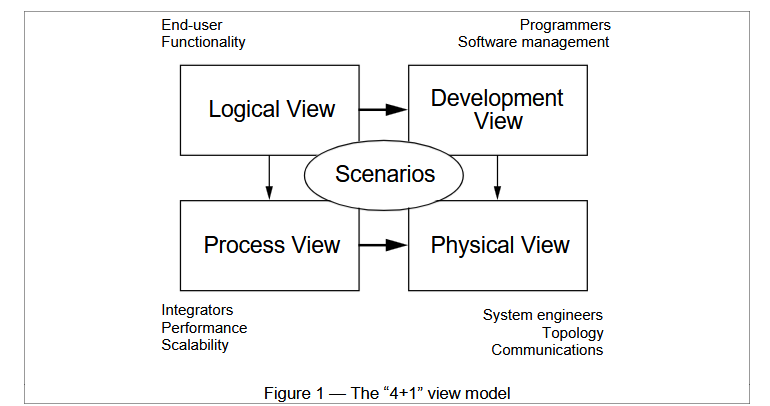
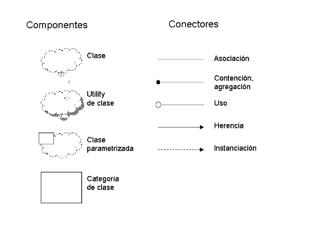
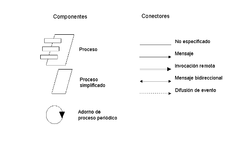
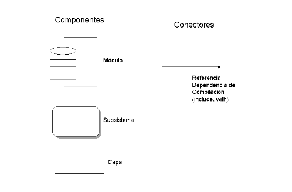
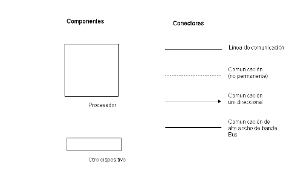
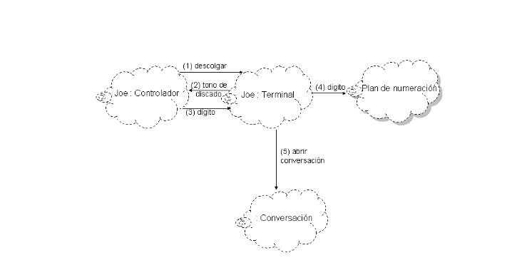

# modelo 4 + 1

este articulo trata sobre la vista 4 + 1 que es una manera de diseñar la arquitectura de software en torno a seprar un proyecto en sus distintos stake holders, esto para tener bien dividio que responsabilidades se corresponden con que distintas areas del desarrollo y asi poder manejar por separado los requerimiento funcionales de los no funcionales

## introduccion

cuando uno quiere plasmar en un diagrama los componenetes que integran su software se encuentra con problmeas que suenan reduntates como "que representa x o y flecha" pero que son escenciales para no solo entender cual es el proyecto sino tambien dar a entender a los stake holders que es lo que deben hacer, es para eso que se crean los modelos de arquitectura

## modelos de arquitectura

la arquitectura de software consta de implementar estructuras de software de alto nivel ensamblando un cierto numero de elementos de arquitectura que busca satisfacie la mayoria de requerimientos funcionales solpandose tambien como aquellos requerimientos no funcionales como confiabilidad, escalabilidad, etc.

Arquitectura de software = {Elements, Forms, Rationale/Constraints}

como la arquitectura de software consta de abstracciones en la vista 4 + 1 las dividimos en 5

- vista logica: es el modelo del objeto (hablando siempre de POO)
- vista de procesos: habla sobre la concurrencia y sincronizacion de cada aspecto
- vista fisica: son las piezas de software distribuidas en distintos hardware
- vista de desarrollo: describe la organizacion estatica del software y su entorno de desarrollo
- escenarios: son los caso de uso que nuclean a todas las partes

## vista logica

se apoya principalmente en los requisitos funcionales, lo que el sistema debe brindar en terminos de servicios a sus usuarios, se compone mayormente de abtracciones claves tomadas en principio del dominio del problema usando POO, se hace esto para poder potencial el analisis funcionar e identificar mecanismos y elementos comunes a diversas partes del sistema, para represetar esta arquitectura se usan diagramas de clases y templates de clase con enfoque Booch / Racional

### notacion

## vista de procesos

esta vista toma en cuenta algunos requisitos no funcionales tales como perfomance y disponibilidad, se enfoca en la concurrencia y distribucion, integridad del sistema, tolerancia y fallas, vista de procesos y tambien especifica a cual hilo de control ase ejectua efectivamente una oprecaion de una clase identificada en la vista logica la arquitectura de procesos se descibe en varios niveles de abstaccion, donde cada nivel se refiere a distintos intereses, en su nivel mas alto puede verse como redes logica de programas comunicantes que se vinculan sus respectivos recursos de hardware mediante redes lan, wan, buses, etc.
    un porceso es una agrupacion de tareas que forman una unidad ejecutable, estos pueden replicarse para aumenta la
distribucion de la carga de procesamiente

### particiones

se particionan en conjuntos de tareas independientes, pueden distinguirse como

#### tareas mayores

Son los bloques arquitectónicos principales.

Se pueden identificar de forma unívoca (sin ambigüedades).

Se comunican usando mecanismos de comunicación bien definidos, como:

- Envío de mensajes (sincrónico o asincrónico).

- Llamadas a procedimientos remotos (RPC).

- Difusión de eventos.

No deben asumir que están en el mismo proceso o en el mismo nodo que otras tareas mayores. Esto significa que deben funcionar como si pudieran estar en cualquier lugar del sistema distribuido.

#### Tareas menores

Son detalles de implementación, no son parte de la arquitectura principal.

Se agregan para funciones específicas como:

- Actividades cíclicas.

- Manejo de buffers.

- Esperas temporales (timeouts).

Se implementan como hilos livianos o tareas internas.

Pueden comunicarse de formas más simples: por rendezvous (sincronización directa entre dos tareas) o memoria compartida.

### notacion

 
## vista de desarrollo

es la organizacion real de los modulos de software, el mismo se empaqueta en partes pequeñas, bibliotecas de programas, subsistemas, que pueden ser desarrolladas por uno o varios grupos de desarrolladores, estos se dividen en jerarquias de capas, esta tiene mas en cuenta los resquisitos internos relativos a la facilidad de desarllo administracion del software, reutilizacion, elementos comunes y restricciones impuestas por las herramienta o el lenguaje utilizados, apoya la evaluacion de costos, la planificacion, el monitoreo de progreso del proyecto,
y tambien como base para analizar reuso, portabilidad y seguridad. Es la base para establecer una lınea de
productos

### notacion

## arquitectura fisica

es el mapeado del software a hardware, toma en cuenta netamente los requisitos no funcionales como disponibilidad, confiabilidad, tolerancia a fallos, performance y escalabilidad, el software se ejecuta en una red de computadoras o nodos con variados elemenots como redes, procesos, tareas y objetos que deben ser mapeados en sus respectivos nodos

### notacion 

## escenarios

son todas las partes juntas, los elementos de las 4 vistas trabajan en conjunto para poder resolver nuestro escenarios (mayormente casos de uso) para los cuales describimos una serie de interacciones entres si, sirven como

- guia para descubrir elementos arquitectonicos
- como un rol de validacion e ilustracion al completar la arquitectura

### notacion 

