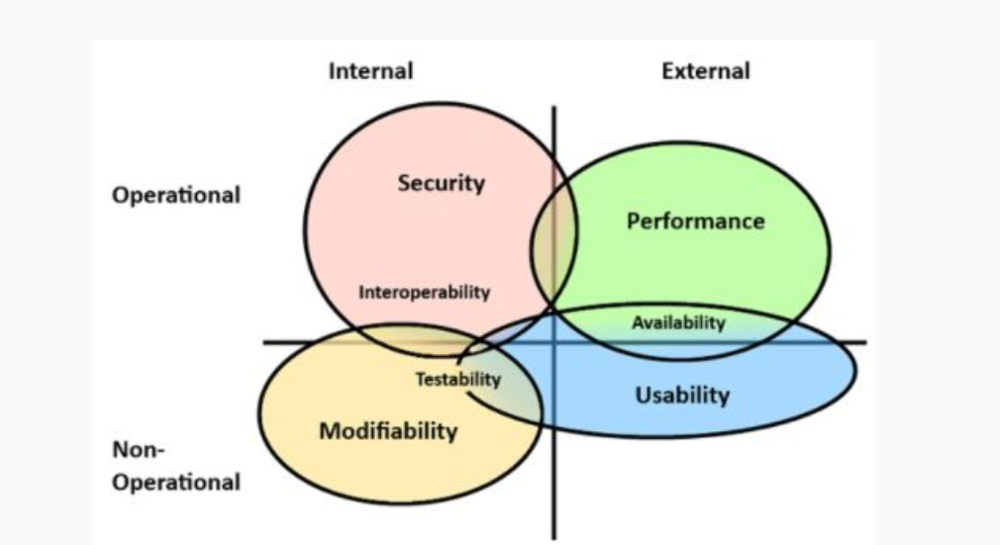
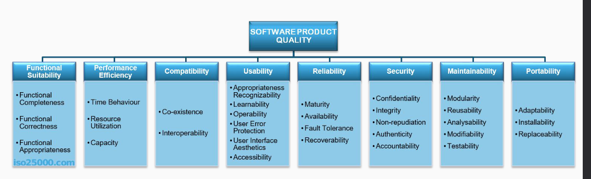
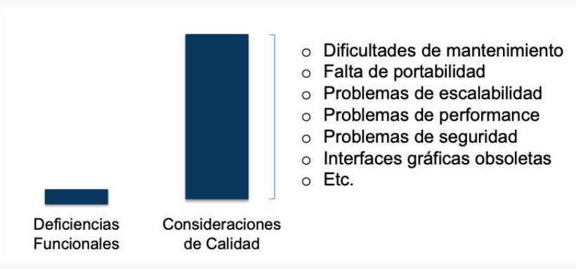
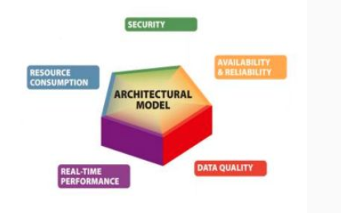

# atributos de calidad 

un atributo de calidad es una medida o propiedad testeable de un sistema que es usada para indicar como el sistema satisface las necesidades de sus stake holders

la clasificacion mas general consiste en dividir los atributos internos de los externos y los operacionales de los no operacionales tal que el mapa queda

otra clasificacion es la ISO/ IEC FCD 25010

## porque se rediseñan los sistema

Las consideraciones de calidad se desprenden de las necesidades del negocio y deben jugar un rol fundamental durante el ciclo de vida del desarrollo de software. No todo es funcionalidad en un sistema.

## algunos atributos son

- Disponibilidad
- Reusabilidad
- Performance
- Robustez
- Flexibilidad
- Testeabilidad
- Interoperabilidad
- Usabilidad
- Mantenibilidad
- Integridad
- Portabilidad
- Confiabilidad

## algunos pueden entrar en conflicto con otros

- Seguridad vs confiabilida
- Portabilidad vs Performance
- Seguridad vs Usabilidad
- Performance vs Modificabilidad

el objetivo es evaluar cuantitativa o cualitativamente multiples atributos de calidad

- concensuar una priorizacion de los atributos de calidad
- diseñar un sistema lo suficientemente bueno para todos los interesados

## disponibilidad

que pasa si falla el sistema

que tan probable es que ocurra

en cuanto se repara

la disponibilidad de un sistema es la capacidad del mismo de encontrarse operativo por una cantidad de tiempo determinado en horas, dias y años, es fundamental tanto para ciertas paginas web como para servicios publicos y/o de infraestructuras criticos

### como se mide

se mide en porcentajes en base a cuanto el sistema estuvo operando en comparacion al tiempo total, ejemplo si funciono 364 dias del año su disponibilidad fue del (364/365) * 100% = 99.73%

### factores clave

- robustes
- gestion de recursos
- mantenimiento
- supervision /  deteccion de fallos
- recuperacion ante desastres

### Importancia de la Disponibilidad

- Negocios
- Usuarios Finales
- Seguridad

### Ejemplos de Estrategias para Mejorar la Disponibilidad

- Balanceo de carga
- Replicación de Datos
- Respaldo y Recuperación
- Escalabilidad

la disponibilidad es esencial para garantizar que los sistemas de software cumplan con las expectativas de losusuarios y las necesidades del negocio. Por lo tanto, los ingenieros de software deben diseñar y desarrollar aplicaciones teniendo en cuenta la disponibilidad desde el principio, implementando estrategias para mitigar fallos y garantizar la continuidad del servicio

## performance

son los tiempos de respuesta de la aplicacion en relacion a las funcionalidad o actividades soportada por la misma

### como se mide

#### latencia

tiempo dedicado a responder a un evento

#### capacidad

el numero de eventos que pueden ocurrir al mismo tiempo

## interoperabilidad

es la capacidad de intercambio de informacion de una aplicacion con otros sistemas o con el entorno donde opera, una aplicacion bien diseñada facilita la integracion con otros sistemas

### como se mejora

mediante interfaces externas bien diseñadas, normas de intercambio y estandares

## usabilidad

se ve a traves de los siguientes atributos

### comprensibilidad

este atributo refleja que tan fácil es para el usuario comprender el sistema, que conocimientos previos requiere el usuario para poder trabajar con el software

### facil uso / eficiencia

que permita realizar operaciones de manera rapida y efectiva

### otros atributos

- facil de recordar
- intuitiva
- estandar
- atractividad
- agradable
- comoda

## seguridad

Es el atributo que permite medir la vulnerabilidad de las aplicaciones a ataques accidentales o maliciosos, versus la posibilidad de defensa del sistema ante pérdidas o robo de información estratégica y valiosa para la organización.

Dichos ataques pueden ser internos o externos

### medidas para responder

- autentificacion
- autorizacion
- encriptacion
- auditoria
- capacidad de deteccion de ataques de denegacion de serivicio
- restriccion de acceso a usuarios de acuerdo a politicas de autentificacion
- prevencion de inyeccion sql
- encriptacion de claves, contenidos y datos empresariales
- conexion segura

## escalabilidad

Es la capacidad de manejar la carga de trabajo de la aplicación sin afectar el rendimiento de la misma, es la posibilidad de crecimiento sin perjudicar su funcionamiento operativo.

### como se mejora

#### vertical

para crecer se agregan mas recursos fisicos a la infraestructura que soporta al aplicativo como memoria, almacenamiento, proce, capacidad de computo,etc

#### horizontal

Se incrementa el numero de computadoras para dividir la carga

### indicadores clave para medir la escalabilidad

- si el sistema permite el escalamiento vertical o distribucion de la carga de trabajo
- es tiempo que conlleva el escalamiento
- las limitaciones del escalamiento respecto a la arquitectura operativa: numero maximo de servidores, memoria, discos, o capacidad de red
- posibilidad de escalamiento: incremento de numero de transacciones o carga de trabajo