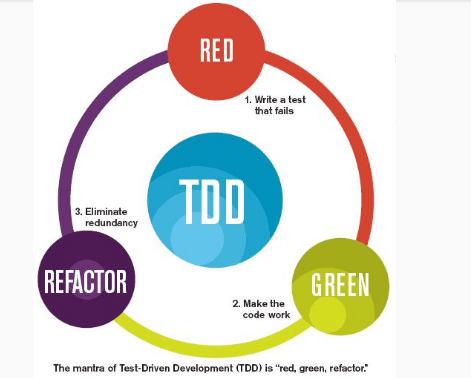

# coding dojo / kata

## kata

viene del karate, en la artes marciales es la repeticion de una serie de tecnicas, en el codigo es lo mismo, la idea no es llegar a una respuesta correcta sino ir aprendiendo con la misma

## coding dojo

un lugar seguro para practicar, donde se pueden cometer errores, la idea es juntarse para trabajar en una kata y pasarlo bien y practicar

[coding dojo](https://codingdojo.org/practices/WhatIsCodingDojo/)

## TDD 

### pasos

1. creas un test que falle
2. haces un codigo que lo mas reducido posible para pasarlo
3. refactorizas ese codigo
4. repetis

### tres leyes del tdd

1. esta prohibido crear cualquier codigo que no tenga como objetivo hacer que pase un test
2. esta prohibido crear mas codigo que el suficiente para hacer fallar un test
3. esta prohibido escribir mas codigo de produccion que el suficiente para pasar un test que falle

siempre baby steps

### paginas de katas

## iniciacion

- https://github.com/ferpega/ohceKata
- https://github.com/trikitrok/ohce-kata-java-using-outside-in-tdd
- https://github.com/francho/kata-ohce

## refactorin

- https://github.com/DoDevJutsu/incomprehensible-finder-refactoring-java
- https://github.com/celtric/incomprehensible-finder-refactoring-java