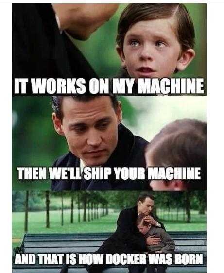
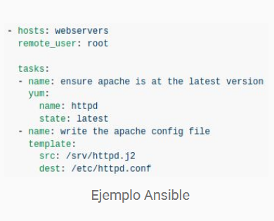
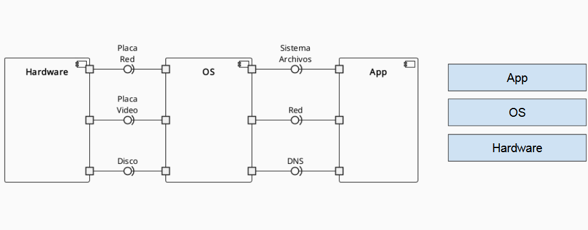
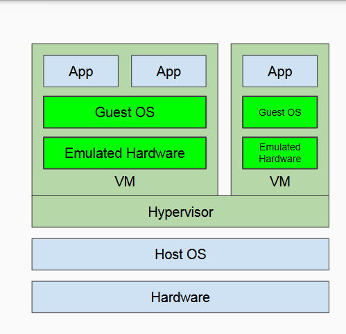
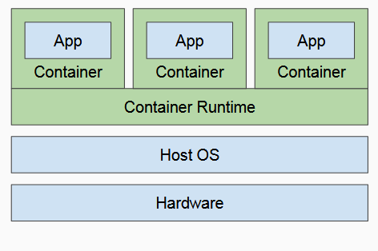
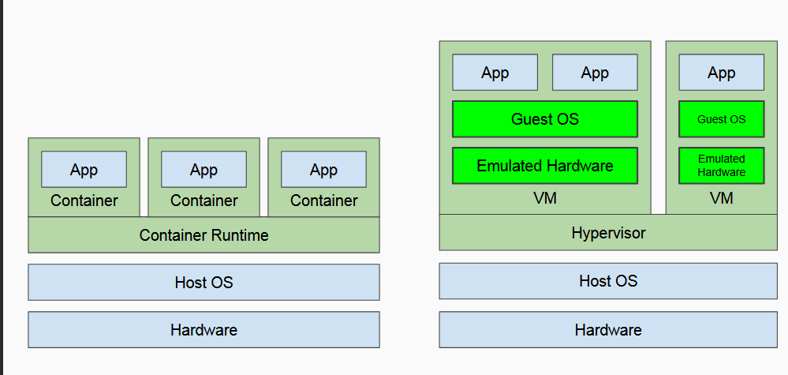
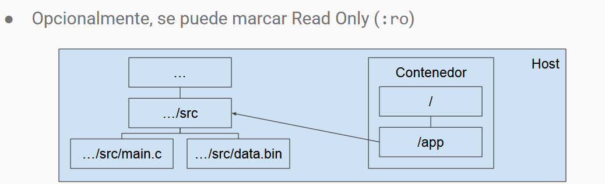
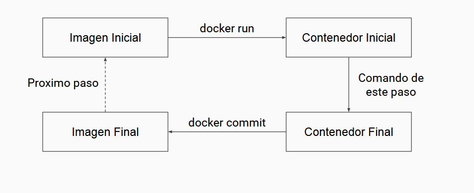

# docker



## que es docker

docker automatiza el despliegue de aplicaciones aisladas en contenedores

## tradicionalmente

### como se despliega una aplicacion

- acceder directamente al sistema a configurar
- copiar codigo/ejecutable a desplegar
- usar herramientas interactivas para inspeccionar y modificar sistemas
- asegurar que todas las dependencias este presentes

### problemas

- altamente repetitivo
- gran chance de error
- interacciones entre aplicaciones
- es dificil reconstruir la configuracion(en mi maquina funciona)

## infraestructura as Code (IaC)

en lugar de realizar modificaciones manualmente se usa un lenguaje de programacion especifico para el dominio de configuraciones de maquina

Algunas herramientas:

- chef
- puppet
- ansible
- terraform

## infraestructura declarativa

las herramientas de infraestrutura como codigo suelen ser declarativas

Declarativo: especifica que objetivo lograr
Imperativo: especifica el como 



## Mascota vs ganado

### infraestructura mascota

- nombre especifico
- unicas
- cuidadas
- mantenimiento delicado
- presentes aunque no sean necesarios
- servicios legacy
- servicios unicos 

### infraestructura ganado

- numero de serie
- practicamente identicas
- remplazables
- "mantenimiento" creando otras intancias
- se crean y se destruyen a necesidad
- servicios sin estado interno relevante

## maquinas virtuales



emulacion de una maquina real
- provee aislamiento total
- unica opcion para ejecutar programas de otras arquitecturas de hardware
- al menos dos sistemas operativos ejecutandose

algunas herramientas
- virtual box
- vmware



## linux namespaces

separa grupos del sistema para que diferentes procesos tengan acceso a diferentes conjuntos de recursos

- mnt (sistema de archivos)
- pid (listados de procesos)
- net (interfaces de red)
- ipc (comunicacion entre procesos)

mostrar todos los procesos: 
``` bash
$ ps -e
PID TTY TIME CMD
1 ? 00:00:33 systemd
2 ? 00:00:00 kthreadd
4 ? 00:00:00 kworker/0:0H
6 ? 00:00:00 mm_percpu_wq
```

mostrar todos los procesos, aislando el namespace pid:

```bash

$ unshare --pid --mount-proc --fork ps -e
PID TTY TIME CMD
1 pts/0 00:00:00 ps
```

## contenedores

Linux namespaces para separar grupos de procesos

- aislamiento configurable de aplicaciones
- usan el mismo kernel que el host
- overhead minimo

Algunas herramientas

- Docker
- LXC



## contenerdores vs virtual machine



## docker

conceptos centrales que administra docker 

- container: grupo aislado de procesos
- image: template usado para crear crear contenedores (sistemas de archivos + meta data)
- dockerfile: Archivo con instrucciones para construir una imagen

## que brinda docker

- consistencia:

cualquier imagen se obtiene , inicia y configura de la misma forma

- replicidad

los contenedores basados en una misma imagen con inicialmente iguales

- aislamiento 

se puede controlar la interaccion entre el conetenedor y el mundo exterior

```bash
Docker
$ docker run hello-world
Hello from Docker!
This message shows that your installation appears to be working correctly.
To generate this message, Docker took the following steps:
1. The Docker client contacted the Docker daemon.
2. The Docker daemon pulled the "hello-world" image from the Docker Hub.
(amd64)
3. The Docker daemon created a new container from that image which runs the
executable that produces the output you are currently reading.
4. The Docker daemon streamed that output to the Docker client, which sent it
to your terminal.
To try something more ambitious, you can run an Ubuntu container with:
$ docker run -it ubuntu bash
Share images, automate workflows, and more with a free Docker ID:
https://hub.docker.com/
For more examples and ideas, visit:
https://docs.docker.com/get-started/
```

.png)


```bash
Docker
$ docker run -it eclipse-temurin:11-jre java --version
openjdk 11.0.20.1 2023-08-24
OpenJDK Runtime Environment Temurin-11.0.20.1+1 (build 11.0.20.1+1)
OpenJDK 64-Bit Server VM Temurin-11.0.20.1+1 (build 11.0.20.1+1, mixed mode, sharing)

$ docker run -it eclipse-temurin:17-jre java --version
openjdk 17.0.8 2023-07-18
OpenJDK Runtime Environment Temurin-17.0.8+7 (build 17.0.8+7)
OpenJDK 64-Bit Server VM Temurin-17.0.8+7 (build 17.0.8+7, mixed mode, sharing)
```

.png)

Docker
No hay forma de compartir un contenedor en sí, pero se pueden compartir:
- Imágenes en repositorios como hub.docker.com
- Imágenes exportadas a archivos comprimido
- El Dockerfile que generó la imagen (Aunque eso no garantiza generar una imagen idéntica)

### otro elementos

mounts: acceso a directorios del host
volumes: area donde persisten los datos
networks: interfaces de red internas
ports: forwardear puertos del host a puertos del contenedor

 ```
 Docker
$ docker run -v host_dir:container_dir
 ```


- configura un directorio del contenedor para que el jernel lo trate como acceso a un directorio del host



## comandos utiles

- docker logs

- Listado de objetos
  -- docker images ls
  -- docker container ls
  -- docker volume ls
- eliminar objetos
  -- docker image rm
  -- docker container rm
  -- docker volume rm
- control de contenedores
  -- docker run <image>
  -- docker stop<container>
  -- docker start<container>
  -- docker kill<container>

## contenedores livianos

docker asume que los contenedores son livianos

- unico proposito
- -- ejecutan un comando
- -- no incluyen dependencias innecesarias
- mantienen el estaod minimo necesario
- -- no significa poco
- -- se pueden enceder y apagar facilmente
 


## docker file

las imagenes se almacenan como una referencia a la imagen anterior y una lista de referencias llamadas layers

-- cada layer es inmutable

-- las referencias son de un layer a su predecesor
 
--- dos build pueden comparti layer hasta a la primer diferencia
--- un archivo agregado en un layer y borrado en otro sigue siendo accesible
--- imagenes ya contruidas sirven como una cache

