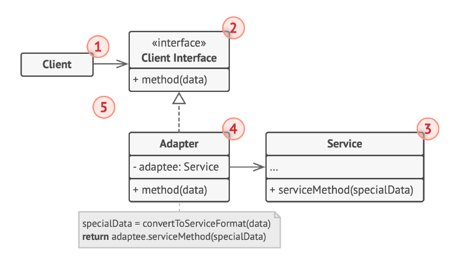
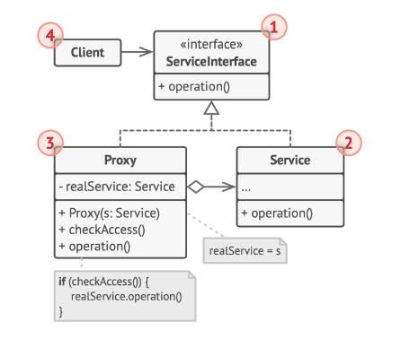
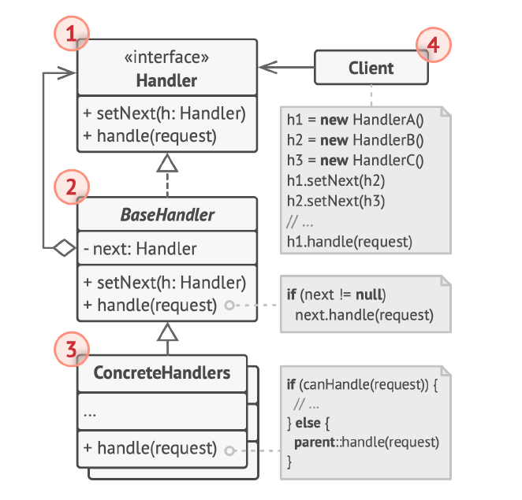
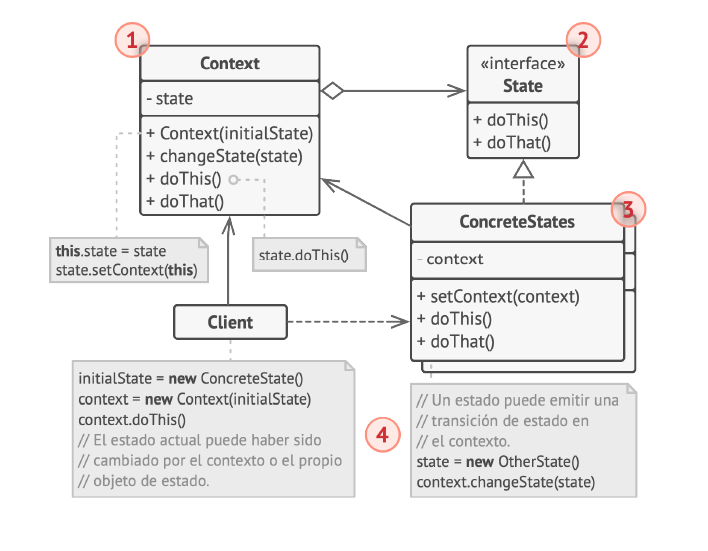
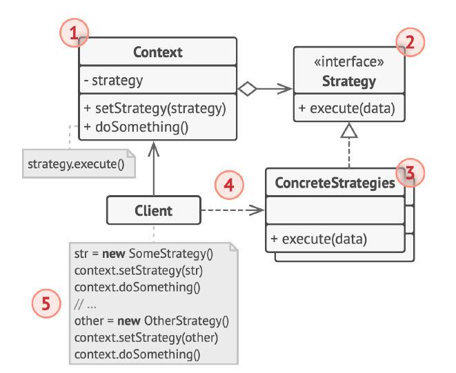

# patrones de diseño

son soluciones habituales a problemas frecuentes en el software, si te encuentras un problema seguramente alguien ya hizo la solucione, eso son los patrones, planos prefabricados que se pueden personalizar para resolver codigo

## creacionales

proporcionan mecanismos de creacion de objetos que incrementan la flexibilidad y la reutilizacion de codigo existente

### factory 

proporciona una interfaz para crear objetos en una superclase mientras premite crear objetos en una superclase que permite a las sublcclases alterar el tipo de objetos que se crearan

la idea seria que al querer crear un objeto en vez de instanciarlo con un new se invoque a un metodo fabrica, permitiendo asi poder crear varias clases con interfaz compartida pero estructuras y metodos distintas

esto permite mantener un estandar a la hora de crear objetos de clases distintas con una misma *interfaz*, clave interfaz ya que que las clases la compartan es obligatorio para que el factory tenga sentido

el objetivo es que el codigo cliente tenga una interfaz unica de creacion de objetos que a su vez comparten una interfaz haciendo que sea indistinto el tipo de clase que devuelva el factory ya que este es de la interfaz que el cliente espera

#### estructura 

##### creador

es la clase padre que provee el metodo de crear que espera un producto

##### creador concreto

es el creador concreto que devuelve un producto

##### producto

es la interfaz que unifica el comportamiento de las dos clases fabricadas

##### producto concreto

son las clases concretas que seran creadas en la factory

#### contextos de uso

- para separar el codigo de construccion del objeto del codigo que lo usa en s haciendo mas extensible la creacion de los productos de forma independiente al resto del codigo
- para extender comportamiento mediante la creacion de objetos sin necesidad de caer en la herencia (relacion mas rigida)
- para ahorrar recursos de sistema ya que te permite llamar a objetos ya existentes (creadores) en vez de crearlos de nuevo

#### pros

- bajo acoplamiento entre creador y producto
- S de solid: moves la responsabilidad de la creacion de objetos a otro lado
- O de solid: permite incorporar nuevos tipos de fabrica sin modificar el codigo del cliente

#### contras

- se complejiza el codigo por todas las subclases requeridas
  
### Builder

permite construir objetos complejos paso a paso, el patron nos permite producir distintos tipos y representaciones de un objeto empleando un mismo codigo de construccion

consiste en sacar el codigo de construccione de un objeto de su propia clase y lo coloque dentro de objetos independientes llamadados constructores, se organiza la construccion de un objeto en una serie de pasos, para crearlo se ejecutra esta serie de pasos en un objeto constructor, lo escencial es que no necistas invocar todos los pasos, se pueden invocar solo aquellos que sean necesarios para producir un objeto en particular

se crean distintos constructores que permiten crear objetos de distintas caracterisiticas y comportamientos, estos a su vez pueden tener una clase directora (el builder) que se encarga de dar las indicaciones a las distintas clases, esta no es indispensable ya que se pueden invocar a los constructores directamente en el cliente pero es muy util tenerla a la hora de generar ciertas rutinas de construccion en el programa

#### estructura

##### interfaz constructora

declara pasos de construccion de producto que todos los objetos constructores tienen en comun

##### constructores concreto

tienen distintas implementaciones de los pasos de construccion, pueden crear productos que no siguen la interfaz comun

##### productos

son los objetos resultantes construidos por distintos objetos, no tienen que pertenecer a la misma jerarquia de clases o interfaz

##### director

definen el orden en el que se invocaran los pasos de los constructores, puede crear y reutilizar construcciones especificas de los productos

##### cliente

debe asociar uno  de los objetos constructores con la clase directora, se hace una vez mediante los parametos de la clase directora que utiliza ese constructor para el resto de la construccion

#### casos de uso

- cuando necesites un constructor con muchos parametros opcionales
- cuando necesites que el codigo cree distintas representaciones de ciertos productos

#### pros

- permite crear productos paso a paso, aplazar pasos, ejecutarlos de forma recursiva
- puedes reutilizar el mismo codigo de construccion al construi varias representaciones del producto
- S de solid: podes aislar el codigo de construccion complejo de la logica de negocio
  
#### contras 

la complejidad general del codigo aumenta ya que se requieren de varias clases nuevas

### singleton

permite crear una clase que tenga una unica instancia y a su vex darle un acceso global a esta misma

consiste en hacer privado el constructor de una clase por defecto para que no pueda ser instanciada por otra clase, crear un metodo de creacion estatico que actue como constructor dentro de la clase este metodo llama el constructo privado, entonces cuando se lo llama desde fuera se llama a la instancia ya almacenada en el cache del programa

#### estructura

- singleton: la clase singletoo posee un metodo llamado obtenerInstancia que es la unica manera de obtener la instancia del singleton

#### casos de uso

- cuando tenes un objeto que requiere tener una unica instancia usada por todo el programa por ejemplo una clase que se conecte con la base de datos
- para poder usar variables globales en todo el programa

#### Pros y contras

- tenes la certeza de que una clase tiene una instancia unica
- tenes un punto de acceso global a dicha instancia
- solo se lo inicializa cuando se lo requiere por primera vez

#### Contras

- vulnera la S de solid, resuelve 2 patrones al mismo tiempo
- puede enmarcar un mal diseño, ejemplo cuando los componentes del programa saben demasiado los unos de los otros
- el patron requiere de un tratamiento especial en un entorno con multiples hilos de ejecucion
- son dificiles de testear en el codigo cliente

## estructurales

son patrones que explican como ensamblar objetos y clases en estructuras mas grandes, permitiendo flexibilidad y eficiencia en las mismas

### adapter

permite la colaboracion entre objetos con interfaces incompatibles, es un objeto especial que convierte la interfaz de in objeto de forma que otro objeto pueda comprenderla, envuelve uno de los objetos para esconder su complejidad de la conversion que tiene lugar tras bambalinas, el objeto envuelto ni si quieraas es conciente de la existencia del adaptador, permite adaptar tipos de datos e interfaces distintas

#### estructura 

- cliente: contiene la logica de negocio
- la interfaz con el cliente: describe un protocolo que otras clases deben seguir para poder colaborar con el cliente
- servico: es alguna clase util (normalmente tercera o heredada) con la cual el cliente no puede colaborar porque son incompatibles
- adaptador: es capaz de trabajar tanto con el cliente como el servicio permitiendo asi ser el nexo entre ambas clases

#### casos de uso

- cuando quieras usar una clase existente incompatible con el resto del codigo(ejemplo alguna libreria externa)
- cuando quieras reutilizar varias subclases que carezcan de alguna funcionalidad comun como para aunarla a una super clase

#### Pros

- s de solid: puede separa una interfaz a codigo de conversion de datos de la logica de negocio del programa
- o de solid: podes introducir cuantos adaptadores precises sin modificar el cliente

#### contra 

- aumenta la complejidad general del codigo

### composite

te permite componer objetos en estructuras de arbol y trabajar con esas estructuras como si fueran objetos individuales, se usa con clases que contienen otras subclases, se usa una interfaz intermedia para que al usarse en el compuesto tenga un compartamiento y al usarse en el compositor tenga la sumatoria de sus componentes internos

#### estructura

- interfaz: describe operaciones comunes entre elementos simples y complejos del arbol
- hoja: elemento basico del arbol no contiene elementos(sulen ser los que hacen el trabajo real)
- contenedor: es el que tiene subelementos como hojas u otros conetenedors, este no conoce las clases concreatas de sus hijos funciona con todos los subelementos unicamente a traves de la interfaz componente, al recibir una solicitud delega el trabajo a los subelementos, estos devuelven sus resultados y el contenedor los procesa y los devuelve a cliente
- cliente: funciona de la misma manera con las hojas y los contenedores

#### casos de uso

- cuando tengas que aplicar una estructura de arbol
- cuando el codigo cliente tenga que tratar elementos simples y complejos de igual forma

#### pros

- podes trabajar con estructuras de arbol facilmente usando polimorfismo y recursion
- O de solid: puedes introducir nuevos tipos de elemento a la aplicacion sin modificar el codigo ya existente

#### contras

- puede ser dificil proporcionar una interfaz comun para clases cuya funcionalidad difiere demasiado

### decorator 

te permite añadir funcionalidad a objetos colocando estos objetos dentro de objetos encapsuladores especiales que contienen dichas funciones, cuando tenemos que alterar la funcionalidad de un objeto existente lo primero que una piensa es herencia, el problema radica en que esta misma es muy rigida y estatica, no se puede modificar el comportamiento de un objeto en tiempo de ejecucion a su vez la subclase solo puede heredar de una clase, para superar esto podes tener un clase wrapper que envuelva a las clases a las que se quiere agregar este comportamiento haciendo que para el cliente sean lo mismo pero tu clase wraper va a tener comportamientos propios sumados a los del wrapper

#### estructura

- componente: declara una interfaz comun tanto para wraper como los componente concretos
- concreto: es una clase de objeto envueltos, define el comportamiento basico que los decoradores pueden alterar
- decorador base: tiene un campo para referenciar al objeto envuelto, el mismo debe ser como el de la interfaz del componente, asi puede contener tanto a componentes concretos como a los decoradores, la clase decoradora base delega todas las operaciones al objeto envuelto
- decoradores concretos: definen funcionalidad adicionales que se pueden añadir dinamicamente a los componenetes sobreescribiendo metodos de la clase decoradora base y ejecutan comportamiento
- cliente: puede envolve componente en varias capas de decoradores siempre y cuando trabajen con todos los objetos a travez de la interfaz componente

#### casos de uso

- necesitas asignar funcionalidad adicionales a objetos durante tiempo de ejecucion
- cuando sea raro o imposible aplicar herencia

#### pros
            
- puede extender comportamiento de un objeto sin crear nuevas clases
- puede añadir o eliminar responsabilidades en un objeto en tiempo de ejecucion
- puede combinar varios comportamientos con varios decoradores
- S de solid: podes dividir una clase monolito en varios decoradores que apliquen varios comportamientos por su cuenta

#### contras

- resulta dificil eliminar un wrapper especifico de una pila de wrappers
- es dificil implementar un decorador de tal forma que su comportamiento no depende del orden en la pila de decoradores
- el codigo de configuracion inicial de las capas suele ser desagradable

### Facade

es un patron de diseño estructural que proporciona una interfaz simplificada a una biblioteca , un framework o un grupo complejo de clases, proporciona una interfaz que simplifica un subsistema complejo que contiene muchas clases moviles, proporsiona un funcionalidad limitada en comparacion a interacturar directamente con el subsistema si embargo incluye solo las funciones importantes para los clientes 

#### estructura 

- Facade: un acceso a una parte especifica de funcionalidad del subsistema, sabe a donde dirigir al cliente y como operar todas las partes moviles
- Facade adicional: para sacarle resposabilidad a fachadas que estan creciendo mucho,  estas pueden ser usadas tanto por la fachada como por el cliente
- el subsistema complejo: todas las clases y subclases que integran al subsistema en cuestion
- cliente: utiliza la facha en lugar de invocar a las clases por separado

#### casos de uso

- cuando necesitas una interfaz simplificada pero directa a un sistema complejo
- para estructura tu subsistema en capaz 

#### pros 

- podes aislar tu codigo de la complejidad del subsistema

#### contras

- podes terminar teniendo una superclase acoplada a todas las clases del sistema

#### relacion con otros patrones

- Adapter: define una interfaz para objetos existentes mientras que adapter se encarga de que la interfaz existente pueda ser utilizada
- singleton: muchas veces una fachada en todo el codigo alcanza y por tanto para que mantenga los estados en tiempo de ejecucion se la hace singleton

### proxy

es un patron estructura que ofrece un sustito o marcador de posicion para otro objeto, un proxy permite controlar el acceso al objeto original permitiendo hacer algo antes o despues de que la solicitud llegue al objeto original, tiene la misma interfaz que objeto de serivicio original, la idea es que las peticiones al objeto servicio original pasen primero por el objeto proxy , al recibir dicha peticion el objeto proxy crea el objeto original y luego le pasa la peticion

#### estructura

- interfaz de servicio: el proxy debe seguir esta interfaz para camuflarse con el objeto de servicio
- servicio: es una clase que proporsiona una logica de negocio util
- proxy: esta tiene un campo de referencia que apunta al servicio real, cuando termina el procesamiento de la peticion le pasa la misma al servicio original
- cliente: debe usar la misma interfaz de serivicio para poder comunicarse tanto con el servicio como con el proxy

#### casos de uso

- inicializacion diferida(proxy virtual): es cuando tenes un objeto muy pesado de sistema el cual quizas no es necesario estar ejecutandolo constantemente
- control de acceso(proxy de proteccion): se usa cuando queres que clientes especificos utilicen el objeto especifico 
- ejecucion local del serivicio: es cuando el objeto del servicio se ubica en un servidor remoto
- proxy de registro: cuando quieres mantener un historial de solicitudes en dicho proxy
- proxy de cache: es cuando necesitas guardar resultados en cache, sobretodo si son muchos
- referencia inteligente: para poder eliminar el objeto pasado una vez no haya clientes que lo utilicen
  
#### pros

- controlar al objeto de servicio sin que los clientes lo sepan
- gestionar el ciclo de vida del servicio sin que los clientes lo sepan
- proxy funciona inclusive cuando el objeto de servicio no esta listo o no esta disponible
- O de solid: podes introducir nuevos proxies sin cambiar el servicio o los clientes

#### contras

- el codigo puede complicarse ya que debes introducior gran cantidad de clases nuevas
- la respuesta del servicio puede retrasarse

#### relacion con otros patrones

- adapter: se accede a un objeto existente a trave de una interfaz diferente
- decorator: en este se accede a una interfaz mejorada
- proxy: se accede a un objeto mediante la misma interfaz
- Decorator: tiene estructuras similares pero mientras que proxy gestiona por si mismo el ciclo de vida de un objeto mientras que decorator siempre es controlada por el cliente

## patrones de comportamiento

Los patrones de comportamiento tratan con algoritmos y la asignación de responsabilidades entre objetos

### Chain of responsability

te pérmite pasar solicitudes a una cadena de manejadores, al recibir una solicitud el manejador decide si procesa la peticion o la pasa al siguiente en la cadena, como muchos patrones de comportamiento este aisla un comportamiento y lo combierte en una clase manejadora, en este caso hacemos que cada objeto reciba por un metodo la peticion, en el mismo objeto debe haber una referencia al siguiente en la cadena, la idea seria que esta peticion sea mandada al siguiente en la cadena de no poder ser procesada

#### estructura 

- manejador: declara una interfaz comun a todos los manejadores concretos, normalmente tiene un unico metodo para manejar solicitudes, a veces puede tener otro para establecer al siguiente manejador
- manejador base: es opcional pero puede ser el manejador donde se puede colocar el codigo biolerplate (codigo que no va a alterarse), normalmente esta clase define un campo para almacenar la referencia al siguiente manejador
- manejador concreto: contiene el codigo para procesar las solicitudes, decide si procesarlas y de no poder hacerlo las envia al siguente manejador
- cliente: puede componer cadenas una sola vez o componerlas dinamicamente

#### casos de uso

- cuando tu programa deba procesar distintos tipos de solicitudes de varias maneras, pero los tipos exactos de solicitudes y sus secuencias no se conozcan de antemano
- cuando sea fundamental ejecutar varios manejadores en un orden especifico
- cuando el grupo de manejadores y su orden deban ser cambiados en tiempo de ejecucion

#### pros

- podes controlar el orden de control de solicitudes
- S de solid: podes desacoplar las clases que invocan operaciones de las que las realizan
- O de solid: podes incluir nuevos manejadores a la aplicacion sin tocar el cliente

#### contras

- algunas solicitudes pueden no ser gestionadas

#### relacion con otros patrones

- observer: permite a los receptores subscribirse o darse de baja mientras que chain es mandatorio
- mediator: elimina la conexion directa entre emisores y receptores
  

### observador

permite definir un mecanismo de subscripcion para notificar a varios objetos sobre cualquier evento que le suceda al objeto que observan, consiste en una clase notificadora y clases subscritas a las cuales dinamicamente se pueden "subsribir" o " darse de baja" al observador, cuando este lanza una notificacion las clases subscriptas la reciben y manejan segun sea necesario

#### estructura

- notificador: este envia eventos de interes a las clases subscriptas ya sea cuando se ejecute un comportamiento o este cambie su estado
- cuando sucede un nuevo evento el notificador recorre la lista de subscripcion e invoca el metodo de notificacion declarado en la interfaz de cada subscripto
- Subscriptora: es una interfaz de notificacion, tiene un unico metodo actualizar que reacciona a la notificacion, segun sea necesario puede contener parametros dados por el subscriptor
- concretos: realizan alguna accion en respuesta a la notificacion, todas las clases deben implementar el mismo interfaz para que el notificador no este acoplado a la clase concreta
- Normalmente, los suscriptores necesitan cierta información contextual para manejar correctamente la actualización. Por este motivo, a menudo los notificadores pasan cierta información de contexto como argumentos del método de notificación. El notificador puede pasarse a sí mismo como argumento, dejando que los suscriptores extraigan la información necesaria directamente.
- cliente: crea notificadores y notificados por separado y luego registra los notificados a su notificador

#### casos de uso

- se usa cuando los cambios de estado de un objeto necesitan cambiar otros objetos y el grupo de objetos sea desconocido de antemano o cambie dinamicamente
- objetos de tu aplicacion deben observar a otro pero solo durante un tiempo limitado o en casos especificos

#### pros

- O de solid: podes introducir nuevas clases subscritoras sin tocar a la notificadora y visceversa
- podes establecer relaciones entre objetos en tiempo de ejecucion
  
#### contras

los subscriptores son notificados en orden aleatorio

### state

permite al objeto cambiar su comportamiento en base a su cambio de estado, casi pareciendo otra clase, cuando tengas un comportamiento repetido que varia segun el estado del objeto, podes extraer ese comportamiento en una clase y que este cambie segun en que estado se encuentre la clase que lo use

#### estructura 

- contexto: almacena una referencia a un estado concreto, y delega todo el trabajo especifico a ese estado, esto mediante la interfaz del estado, el contexto a su vez debe tener un setter de estadoo una manera de alterarlo
- estado: ees la interfaz que declara los metodos especificos del estado, este debe ser comun a todos los estados concretos
- concretos: proporcionan implementaciones a los metodos especificos, se puede utilizar clases abstractas intermedias para no duplicar codigo
- tanto estados como contexto pueden settear el cambio de estados

#### casos de uso

- cuando tengas objetos que cambien segun cambie su estado
- para eliminar condicionales anidados
- cuando tengas mucho codigo duplicado por estados similares o muchos condicionales

#### pros

- S de solid: organiza el codigo relacionado con estados particular en clases separadas
- O de solid: introduce nuevos estados sin cambiar clases de estado existente o concretas
- simplifica el codigo eliminando maquinas de estado basadas en condicionales
  
#### contras

- aplicar el patron puede ser excesivo si no se tiene muchos estados o estos no cambian

#### otros patrones

- strategy: de estructura similar, se diferencia en que los strategy pueden no conocerse entre si, distinto a los estados que puede remplazarse entre si

### strategy 

permite definir una familia de algoritmos, colocar cada uno de ellos en una clase separada y hacer sus objetos intercambiables, sugiere que tomes esa clase que hace algo específico de muchas formas diferentes y extraigas todos esos algoritmos para colocarlos en clases separadas llamadas estrategias, La clase original, llamada contexto, debe tener un campo para almacenar una referencia a una de las estrategias. El contexto delega el trabajo a un objeto de estrategia vinculado en lugar de ejecutarlo por su cuenta.

#### estructura 

- contexto: mantiene una referencia a una de las estrategias concretas y se comunica con este objeto únicamente a través de la interfaz estrategia.
- estrategia: La interfaz Estrategia es común a todas las estrategias concretas declara un método que la clase contexto utiliza para ejecutar una estrategia.
- concretas: es la implementacion de cada algoritmo distinto
- La clase contexto invoca el método de ejecución en el objeto de estrategia vinculado cada vez que necesita ejecutar el algoritmo. La clase contexto no sabe con qué tipo de estrategia funciona o cómo se ejecuta el algoritmo.
- cliente: crea un objeto de estrategia específico y lo pasa a la clase contexto. La clase contexto expone un modificador set que permite a los clientes sustituir la estrategia asociada al contexto durante el tiempo de ejecución.

#### casos de uso

- cuando quieras utiliza distintas variantes de un algoritmo dentro de un objeto y poder cambiar de un algoritmo a otro durante el tiempo de ejecución
- cuando tengas muchas clases similares que sólo se diferencien en la forma en que ejecutan cierto comportamiento.
- para aislar la lógica de negocio de una clase, de los detalles de implementación de algoritmos que pueden no ser tan importantes en el contexto de esa lógica
- cuando tu clase tenga un enorme operador condicional que cambie entre distintas variantes del mismo algoritmo

#### pros 

- intercambiar algoritmos usados dentro de un objeto durante el tiempo de ejecución.
- Podes aislar los detalles de implementación de un algoritmo del código que lo utiliza.
- Podes sustituir la herencia por composición.
- O de solid: Puedes introducir nuevas estrategias sin tener que cambiar el contexto

#### contras

- al pedo si tenes un par de algoritmos que rara vez cambian
- los clientes deben conocer las diferencias entre estrategias para seleccionar la que va
- Muchos lenguajes de programación modernos tienen un soporte de tipo funcional que te permite implementar distintas versiones de un algoritmo dentro de un grupo de funciones anónimas. Entonces podes utilizar estas funciones exactamente como habrías utilizado los objetos de estrategia, pero sin saturar tu código con clases e interfaces adicionales.