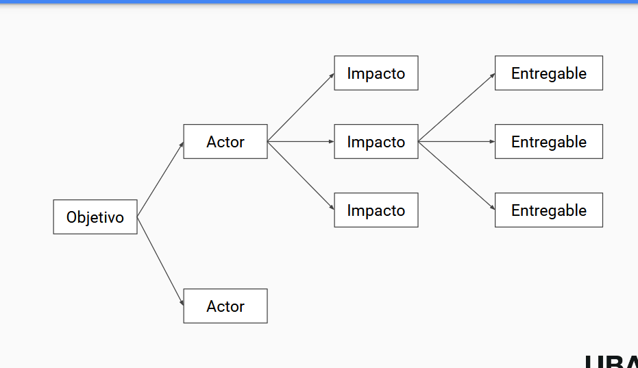

# product discovery

es desenrrollar el problema para entender que producto de software se busca desarrollar, el producto no se termina, esta en cosntante desarrollo

## mentalidad para product discovery

1. colaboracion y aprendisaje en el equipo del producto
2. user centered design
3. humildad intelectual

### colaboracion y aprendizaje

- todo el equipo de producto conoce y aprende del product discovery
- evitando guerra de opiniones
- desarrollando y manteniendo un entendimiento compartido
- con artefactos de visualizacion

### user centered design

- el equipo trabaja en conjunto con usuarios y clientes
- no solo validando problemas y soluciones sino co-crando junto a ellos
- diseñar experiencias

### humildad intelectual

- tolerancia a la incertidumbre
- tolerancia al error y al cambiar de parecer
- construir un ambiente seguro e inclusivo

## problema vs solucion

## entrega

## quiene son mis usuarios/clientes

### personas (ux personas)

- hace foco en segmentos especificos
- tecnica para comprender las diferentes necesidades de los principales tipos de clientes
- También sirve para generar conversaciones valiosas al momento de definir y priorizar las oportunidades

#### ejemplos reales

### mapas de empatia

- Tablero para conocer quién es tu cliente
- Qué problemas y necesidades tiene
- Y qué propuesta de valor le ofreceremos

## historia de usuario

es un concepto de las metodologias agiles, conciste en describir la funcionalidad del sistema desde el punto de vista de un usuario

- Como <persona>
- Quiero <funcion>
- Para <objetivo>

### como se escriben

#### calidad sintactica

- bien formadas
- atomicas
- minimas

#### calidad semantica

- conceptualmente acertadas
- sin ambiguedades
- orientadas al problema
- sin conflicto

#### calidad pragmatica

- usan oraciones completas
- estimables
- unicas
- uniformes
- independientes
- completas

### Criterios Invest

el backlog debe cumplir que:

#### I (independiente)

separable de otras tareas

#### N (negociable)

no es innecesariamente rigido

#### V (valuable)

aportar valor Cliente/Usuario

#### E (estimable)

posible aproximar costos

#### S (small)

desarrollable en una iteracion

#### T (testeable)

verificable

## epicas

historias de usuario que pueden descomponer en mas historias de usuario

## criterios de aceptacion

condiciones especificas que deben cumplirse para aceptar el trabajo realizado

## casos de usos

son una de serie de acciones realizadas por el sistema que generan un resultado observable de valor

## user story mapping

## impact mapping

