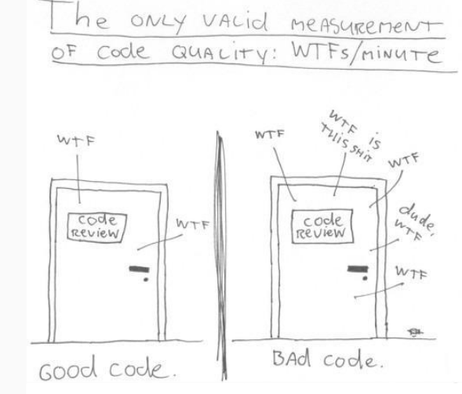
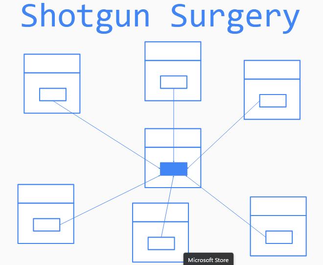

# refactoring 

## que es refactoring

es una tecnica de reestructurar el codigo donde se cambia ka estructura interna del mismo sin modificar su comportamiento externo

## como se logra 

- test unitarios que garantizan que el comportamiento externo no se halla modificado
- aplicando el refactoring propuesto

## refactoring flow

- asegurate que todos los test pasan
- busca codigo oloroso
- busca el refactoring
- aplicalo

## codigo oloroso

es una indicacion de que algo no esta bien a nivel estructural en nuestro codigo por mas que este funciones

- codigo duplicado
- metodos largos
- clases largas
- metodos con muchos parametros
- cambios divergentes
- cirugia a escopetazos (tantas clases depende de una al punto que para modificar esta clase podes romper todas las demas)

- feacture envy: cuando una clase depende mas de metodos de otra clase que de los metodos propios

- data clumps: consiste en estar pasando y solicitando siempre los mismos datos, al punto de que bien podrian ser una clase
- primitive obsession: cuando se usan mas primitivas que clases
- switch: siempre hay que pensar 2 veces si vale la pena usar un switch
- lazy class: clases muy cortas o de un solo metodo
- cadenas de mensajes
- data class: una cosa es un dto otra es una clase anemica
