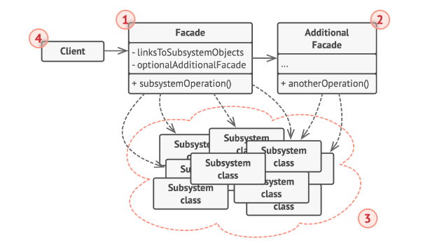
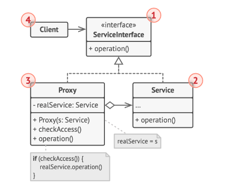

# resumen de la notebook

### Facade

es un patron de diseño estructural que proporciona una interfaz simplificada a una biblioteca , un framework o un grupo complejo de clases, proporciona una interfaz que simplifica un subsistema complejo que contiene muchas clases moviles, proporsiona un funcionalidad limitada en comparacion a interacturar directamente con el subsistema si embargo incluye solo las funciones importantes para los clientes 

#### estructura 

- Facade: un acceso a una parte especifica de funcionalidad del subsistema, sabe a donde dirigir al cliente y como operar todas las partes moviles
- Facade adicional: para sacarle resposabilidad a fachadas que estan creciendo mucho,  estas pueden ser usadas tanto por la fachada como por el cliente
- el subsistema complejo: todas las clases y subclases que integran al subsistema en cuestion
- cliente: utiliza la facha en lugar de invocar a las clases por separado

#### casos de uso

- cuando necesitas una interfaz simplificada pero directa a un sistema complejo
- para estructura tu subsistema en capaz 

#### pros 

- podes aislar tu codigo de la complejidad del subsistema

#### contras

- podes terminar teniendo una superclase acoplada a todas las clases del sistema

#### relacion con otros patrones

- Adapter: define una interfaz para objetos existentes mientras que adapter se encarga de que la interfaz existente pueda ser utilizada
- singleton: muchas veces una fachada en todo el codigo alcanza y por tanto para que mantenga los estados en tiempo de ejecucion se la hace singleton

### proxy

es un patron estructura que ofrece un sustito o marcador de posicion para otro objeto, un proxy permite controlar el acceso al objeto original permitiendo hacer algo antes o despues de que la solicitud llegue al objeto original, tiene la misma interfaz que objeto de serivicio original, la idea es que las peticiones al objeto servicio original pasen primero por el objeto proxy , al recibir dicha peticion el objeto proxy crea el objeto original y luego le pasa la peticion

#### estructura

- interfaz de servicio: el proxy debe seguir esta interfaz para camuflarse con el objeto de servicio
- servicio: es una clase que proporsiona una logica de negocio util
- proxy: esta tiene un campo de referencia que apunta al servicio real, cuando termina el procesamiento de la peticion le pasa la misma al servicio original
- cliente: debe usar la misma interfaz de serivicio para poder comunicarse tanto con el servicio como con el proxy

#### casos de uso

- inicializacion diferida(proxy virtual): es cuando tenes un objeto muy pesado de sistema el cual quizas no es necesario estar ejecutandolo constantemente
- control de acceso(proxy de proteccion): se usa cuando queres que clientes especificos utilicen el objeto especifico 
- ejecucion local del serivicio: es cuando el objeto del servicio se ubica en un servidor remoto
- proxy de registro: cuando quieres mantener un historial de solicitudes en dicho proxy
- proxy de cache: es cuando necesitas guardar resultados en cache, sobretodo si son muchos
- referencia inteligente: para poder eliminar el objeto pasado una vez no haya clientes que lo utilicen

#### pros

- controlar al objeto de servicio sin que los clientes lo sepan
- gestionar el ciclo de vida del servicio sin que los clientes lo sepan
- proxy funciona inclusive cuando el objeto de servicio no esta listo o no esta disponible
- O de solid: podes introducir nuevos proxies sin cambiar el servicio o los clientes

#### contras

- el codigo puede complicarse ya que debes introducior gran cantidad de clases nuevas
- la respuesta del servicio puede retrasarse

#### relacion con otros patrones

- adapter: se accede a un objeto existente a trave de una interfaz diferente
- decorator: en este se accede a una interfaz mejorada
- proxy: se accede a un objeto mediante la misma interfaz
- Decorator: tiene estructuras similares pero mientras que proxy gestiona por si mismo el ciclo de vida de un objeto mientras que decorator siempre es controlada por el cliente

## patrones de comportamiento

Los patrones de comportamiento tratan con algoritmos y la asignación de responsabilidades entre objetos