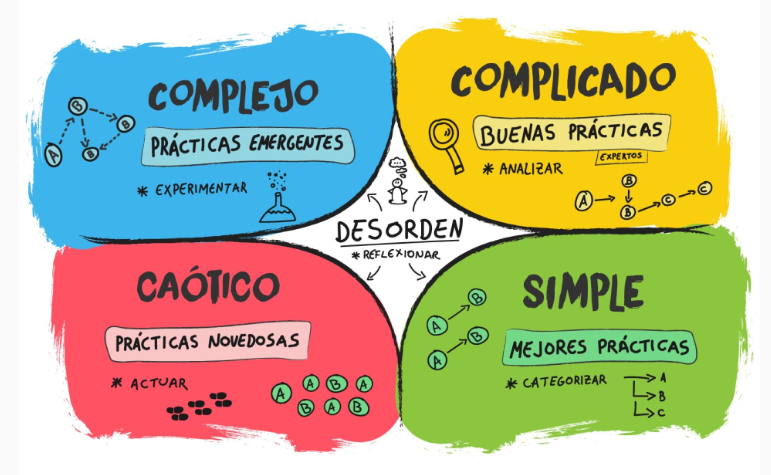
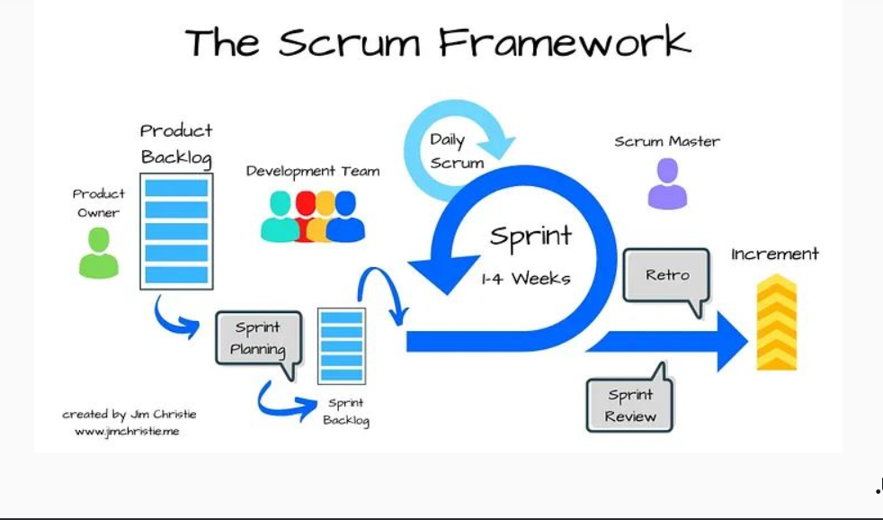
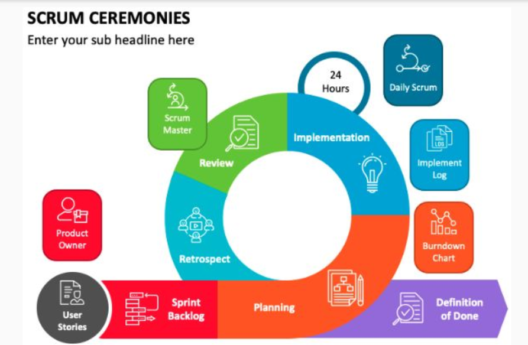
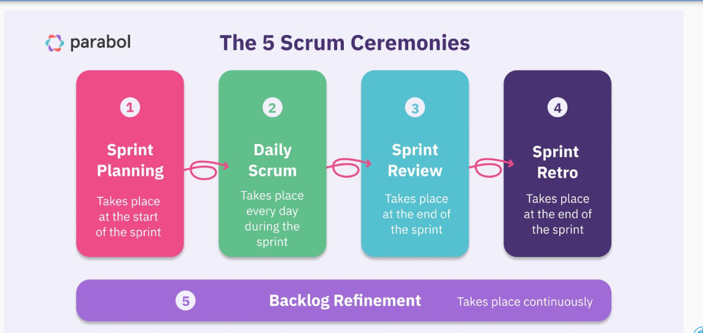
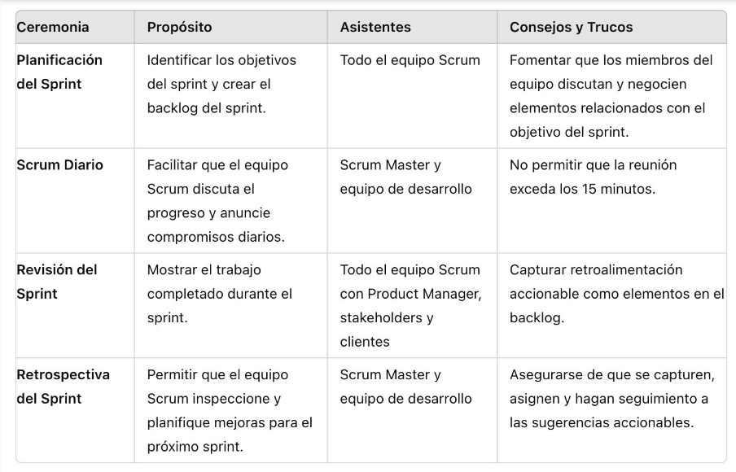

# scrum

## retrotrayendo a Cynefin

## scrum a groso modo

## ceremonias

estas facilidan la comunicacion entre los miembors del equipo y promueven una comprension compartida de lo que se esta construyendo dentro del sprint

## planning

es una reunion donde participan product owner, scrum master y equipo para definir los detalles del backlog de producto, los criterios de aceptacion y los objetivos para completar el sprint, se define cuanto tiempo dura el sprint, el objetivo del mismo y se completa el backlog

## daily

es una reunion de maximo 15 min donde participa el scrum master y el equipo (a veces product owner) en donde se sincroniza el trabajo del equipo, identifican bloqueos o impedimentos y se ajusta el plan del dia

## demo (sprint de revision)

es una reunion que se lleva a cabo el ultimo dia del sprint, en esta el equipo muestra cuanto a avanzado, se muestran caracterisiticas y nuevas funcionalidades adquiridas para los stakeholders, en esta se le invita a los asistentes a proporcionar retroalmentacion sobre el trabajo actual y sugerir cambios

## retro

a veces se confunde con la demo, es un periodo al final de sprint donde se reflexiona sobre los logros y dificultades durante el sprint, ademas de explorar oportunidades para mejorar continuamente el valor incremental que esta proporcionando al producto, se ve que salio y bien y que hay que mejorar para el siguiente sprint

### claves de una retro

- todos hicimos lo que pudimos
- preparacion y participacion
- resperto y confianza
- escuchar no defender
- problemas solucionables
- acciones concretas

## Otras Colaboraciones

- Refinamiento del Backlog

-- Esta reunión permite al Product Owner guiar al equipo en la refinación de las historias de usuario con mayor prioridad en preparación para los sprints futuros. Esto ayuda al equipo a crear un entendimiento compartido de lo que realmente están solicitando los stakeholders o clientes. Responder preguntas clave y compartir una visión clara y común de las solicitudes es esencial para desarrollar y probar con éxito partes del producto.

-- Las sesiones de refinamiento pueden ser reuniones programadas o colaboraciones espontáneas con todos los miembros del equipo presentes.

- Parking Lot (Post Scrum)

-- Colaboraciones necesarias del equipo completo o de miembros específicos del equipo para abordar, resolver y documentar impedimentos al progreso del sprint. Estas reuniones pueden realizarse en cualquier momento.

- Preparación de la Demostración

-- Revisión de la sprint review (demostración) que se realiza al final del sprint, antes de la demostración oficial, para asegurar que el equipo de desarrollo comprende y se siente cómodo al presentar lo que se completó durante el sprint.

## resumen

## estimaciones

no es una estimacion exacta, busca determinar el esfuerzo relativo de las tareas para que el equipo pueda comprometerse con un volumen de trabajo realista en el Sprint

## burndown chart

es un balance entre los story points estimados por sprint vs los story points diarios que fueron descendiendo , se divide en 2 lineas, la ideal que es la promediada vs la real
